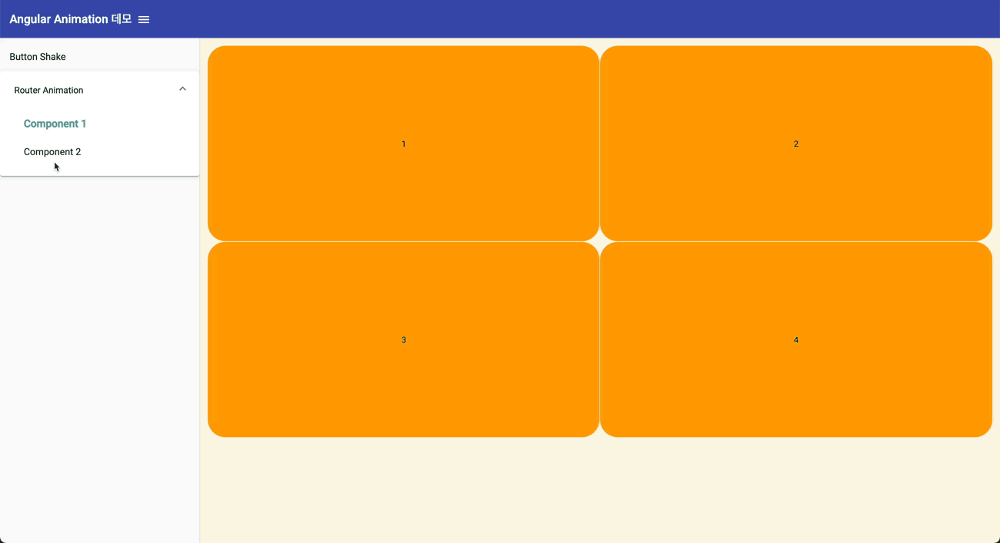

# AngularAnimation
공식문서 : https://angular.io/guide/animations

```
npm i
npm start
```


## [Router Animation](https://github.com/Motiveko/studies/tree/master/Angular-Study/angular-animation/src/app/router-animation)
1. Roueter(상위 컴포넌트)에서 Child Component의 :leave, :enter 에니메이션 동작 지정

- router에 routerAnimation 지정
```html
<div class="router-container" [@routeAnimation]="prepareRoute(outlet)">
  <router-outlet #outlet="outlet"></router-outlet>
</div>
```

- `routeAnimation`에 직접 에니메이션 생성
```ts
const setPositionAbsolute = [
  style({
    position: 'absolute',
    width: '100%',
  }),
];

const initComponents = [
  query(':enter, :leave', [...setPositionAbsolute]),
  query(':enter', [
    style({
      transform: 'translateX(-100px)',
      opacity: 0,
    }),
  ]),
  query(':leave', [
    style({
      transform: 'translateY(0)',
    }),
  ]),
];
export const routeAnimation = [
  trigger('routeAnimation', [
    transition('* => *', [
      ...initComponents,
      group([
        query(':leave', [
          animate(
            '0.3s ease-in-out',
            style({ opacity: 0, transform: 'translateY(80px)' })
          ),
        ]),
        query(':enter', [
          animate(
            '1.2s ease-in-out',
            style({ opacity: 1, transform: 'translateX(0)' })
          ),
        ]),
      ]),
    ]),
  ]),
];
```

2. Router(상위 컴포넌트)에서는 Child Component의 :leave, :enter 에니메이션 `호출`
- 상위 컴포넌트에 에니메이션이 등록되면 기본적으로 자식 컴포넌트의 에니메이션은 블록된다. 자식 에니메이션을 작동시키려면 `animateChild()`메서드를 사용한다.
- 주의할점은, 라우터에서 에니메이션 등록 시 상태가 `:leave` 되는 컴포넌트에는 animateChild()가 작동하지 않는데, 이유는 `<app-child-component1/2>`가 DOM에서 제거되면 그 아래에 자식 노드들에 걸린 에니메이션은 동작하지 않기 때문이다. 이를 해결하기 위해 의미없는 animation을 `:leave` 컴포넌트에 하나 걸어준다.

```ts
export const routeAnimationUsingChilds = [
  trigger('routeAnimation', [
    transition('* => *', [
      query(':enter, :leave', style({ position: 'absolute', width: '100%' }), {
        optional: true,
      }), 
      group([
        // DOM에서 먼저 사라지지 않게 하기 위한 에니메이션. timing은 내부의 :leave시 작동하는 animation의 타이밍보다 길어야 한다.
        query(':leave', [animate('1s', style({}))]),
        query('@*', animateChild(), { optional: true }),
      ]),
    ]),
  ]),
];
```


<br>

- ❗️ ***추가적으로 router animation구성시 아래와 같은 문제가 있다.***
  -  @routerAnimation의 프로퍼티(상태) 값을 아래와 같이 정의한다.`prepareRoute(outlet)`
  ```ts
  // angular animation in-depth guide에서 이런식으로 함수를 정의한다. naviate시 값은 언제나 true다.
  prepareRoute(outlet: RouterOutlet) {
    return outlet?.isActivated || '';
  }
  ```
  - 상태는 항상 true -> true로 변하는데, 이 때 `query()` 메서드로 `:leave`와 `:enter`를 쿼리하면 결과가 empty다. 즉 애니메이션을 위한 position 값 등을 설정할 수가 없다.
  - true -> true 외에도 undefined -> undefined와 같은 형태에서도 똑같이 query할 수 없는 문제가 발생하는데 디버깅이 안돼 원인을 알 수가 없다. 고수가 되면 알게되리..
  - 따라서 에니메이션은 트리거를 `* => *`로 정의해도 상태의 원시값이 변하도록 해서 애니메이션을 트리거 하도록 구성해야한다.
