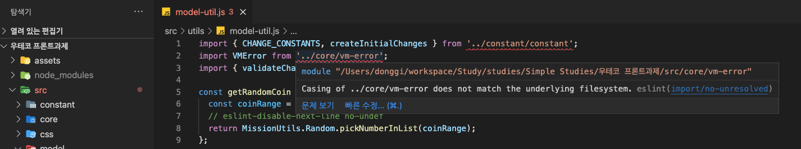

# ESLint, Prettier 정리하기
> 매번 대충 복붙해서 설정하니 할때마다 오류나고 헷갈려서 정리하는 ESLint, Prettier!

<br>

## 목차

  - ### [ESLint](#eslint)
    - ### [1. Configuration](#1-configuration-1)
      - ### [1.1 Configuration Files](#11-configuration-files-1)
        - ### [1.1.2 settings 옵션을 통한 설정 공유](#112-settings-옵션을-통한-설정-공유-1)
        - ### [1.1.3 Cascading Hierarchy](#113-cascading-hierarchy-1)
        - ### [1.1.4 Extending Configuration Files](#114-extending-configuration-files-1)
        - ### [1.1.5 Using a configuration from a plugin](#115-using-a-configuration-from-a-plugin-1)
        - ### [1.1.6 eslint:all, eslint:recommended](#116--eslintall-eslintrecommended-1)
      - ### [1.2 Language Options](#12-language-options-1)
        - ### [1.2.1 Enviroment](#121-enviroment-1)
        - ### [1.2.2 Globals](#122-globals-1)
        - ### [1.2.3 Parser Options](#123-parser-options-1)
      - ### [1.3 Rules](#13-rules-1)
      - ### [1.4 Plugins](#14-plugins-1)
        - ### [1.4.1 Specifying Parser](#141-specifying-parser-1)
        - ### [1.4.2 Specifying Processor](#142-specifying-processor-1)
        - ### [1.4.3 Use a plugin](#143-use-a-plugin-1)
      - ### [1.5 Ignoring Code](#15-ignoring-code-1)
        - ### [1.5.1 ignorePatterns in Config Files](#151-ignorepatterns-in-config-files-1)
        - ### [1.5.2 .eslintignore File](#152-eslintignore-file-1)
        - ### [1.5.3 기타.](#153-기타-1)
    - ### [2. ESLint + Typescript](#2--eslint--typescript-1)
      - ### [2.1 Basic Setting](#21-basic-setting-1)
      - ### [2.2 Advanced Setting](#22-advanced-setting-1)
        - ### [2.2.1 Community Configs](#221-community-configs-1)
        - ### [2.2.2 Plugins](#222-plugins-1)
  - ### [Prettier](#prettier-1)
    - ### [1. Prettier란 무엇일까?](#1-prettier란-무엇일까-1)
    - ### [2. Prettier 적용하기](#2-prettier-적용하기-1)
      - ### [2.1 Basic Settings](#21-basic-settings-1)
      - ### [2.2 Editor Integration](#22-editor-integration-1)
  - ### [실전 설정](#실전-설정-1)
    - ### [@typescript-eslint/unbound-method rule 관련 이슈](#typescript-eslintunbound-method-rule-관련-이슈-1)
    - ### [eslint plugin 전체 disable](#eslint-plugin-전체-disable-1)
    - ### [eslint-plugin-airbnb + prettier](#eslint-plugin-airbnb--prettier-1)
    - ### [object-curly-newline](#object-curly-newline-1)

<br>

# [ESLint](https://eslint.org/docs/user-guide/getting-started)

ESLint는 자바스크립트 파일을 파싱, 분석하고 정의된 rule에 의해 코드의 버그를 리포팅해주고 코드의 일관성 유지를 도와준다.


## 1. Configuration
### 1.1 Configuration Files
### 1.1.1 다양한 종류의 설정 파일
제일 간단하게는 json 파일을 만들고 cli로 eslint를 실행할 때 옵션에 넣어주는 방법이 있다.
  ```
  eslint -c myconfig.json myfiletotest.js
  ```
아래와 같이 `package.json`에 `eslintConfig` 프로퍼티에 설정을 지정할수도 있다.
  ```json
  // package.json
  {
    "name": "mypackage",
    "version": "0.0.1",
    "eslintConfig": {
      "plugins": ["example"],
      "env": {
        "example/custom": true
      }
    }
  }
  ```
하지만 일반적으로 .eslintrc.{js, yml, json, ...} 파일로 설정한다. 여기선 json으로 다룬다.

### 1.1.2 settings 옵션을 통한 설정 공유

`settings`에는 프로젝트에서 공유할 설정을 넣을 수 있다. 곧 나올 `Plugins`는 `settings`의 설정을 공유받아 린팅한다. 커스텀 룰을 추가하고 싶다면 `settings`를 설정하면 된다. `eslint-plugin-import`의 settings 설정 예시는 아래와 같다.
```json
// .eslintrc.json
"settings": {
  "import/resolver": {
    "node": {
      "paths": ["src"],
      "extensions": [".js", ".jsx", ".ts", ".tsx"]
    }
  }
},
```
> ❗️ settings가 사실 정확하게 어떻게 작동하는지 글을 작성하는 시점에서는 잘 모르겠다. 공식문서가 너무 대충써져있다. 추후 학습을 통해 알게되면 개선하도록 한다.

<br>

### 1.1.3 Cascading Hierarchy

린트 설정은 Cascading Hierarchy(연속 계층구조?)가 적용된다. 하위 프로젝트의 `.eslintrc` 파일은 상위 디렉토리로 프로젝트의 root directory까지 혹은 `root: true`인 `.eslint`를 찾을때까지 탐색을 진행한다. 그 결과 발견된 상위 디렉토리의 lint 설정은(`.eslintrc`와 `package.json`의 `eslintConfig` 필드) 하위 디렉토리에도 적용된다. 프로젝트의 lint 설정에 상위 프로젝트의 설정이 덮어써지길 원치 않으면, 설정에 `"root": true`를 추가하면 된다.

린트 설정의 상속에서도, 우선순위가 있는데 아래와 같다. 각각 우선순위 높은것 -> 낮은것 순이다.

1. 인라인 설정
    - `/*eslint-disable*/` and `/*eslint-enable*/`
    - `/*global*/`
    - `/*eslint*/`
    - `/*eslint-env*/`
2. CLI 옵션
    - `--global`
    - `--rule`
    - `--env`
    - `-c`, `--config`
3. 프로젝트 레벨 설정
    - `.eslintrc.*` or `package.json`
    -  상위 디렉토리의 `.eslintrc.*` and `package.json` 파일

<br>

### 1.1.4 Extending Configuration Files
`extends`옵션은 다른 설정 파일을 상속할 수 있게 만든다. npm을 통해 외부 설정 파일을 설치하고, `extends`에는 상속하려는 설정파일 이름의 문자열 혹은 배열 형태로 설정한다.
설정 파일의 `eslint-config-` 접두사는 생략가능하다. 예를들어 `eslint-config-airbnb`는 `airbnb`로 쓸 수 있다.

현재 설정파일의 `Base config`와 `extends`에 설정한 `Derived Config`는 합쳐져 다양한 방식으로 적용될 lint rule을 생성하는데 예를들면 아래와 같다.

1. 추가적인 rule의 추가
2. 병합하여 새로운 rule 생성 
    - Base config : `"eqeqeq": ["error", "allow-null"]`
    - Derived config: `"eqeqeq": "warn"`
    - Result config: `"eqeqeq": ["warn", "allow-null"]`
3. base rule 적용
    - Base config: `"quotes": ["error", "single", "avoid-escape"]`
    - Derived config: `"quotes": ["error", "single"]`
    - Resulting actual config: `"quotes": ["error", "single"]`
4. dervied rule 적용
    - Base config: `"max-lines": ["error", { "max": 200, "skipBlankLines": true, "skipComments": true }]`
    - Derived config: `"max-lines": ["error", { "max": 100 }]`
    - Resulting actual config: `"max-lines": ["error", { "max": 100 }]`, `skipBlankLines`와 `skipComments` 기본 `false`

> ❗️ 1,2 는 이해가 가는데 2,3,4 는 서로 상충되는 내용이다. 어떨때 어떤 옵션이 적용되는지는 글을 작성하는 시점에는 모르겠다. 설명에 안나옴

### 1.1.5 Using a configuration from a plugin
`plugins` 옵션을 통해 npm 패키지에서 ESLint Extendsion인 plugin들을 설치해 사용할 수 있다. 대표적인 플러그인에는 
`@typescript-eslint/eslint-plugin`, `eslint-plugin-import`, `eslint-plugin-html` 등이 있다. 설정시 접두사 `eslint-plugin-`은 생략 가능하다. 뒤에 다시 자세히 다룬다.

### 1.1.6  eslint:all, eslint:recommended
`"extends": "eslint:all"`을 통해 현재 설치된 eslint의 모든 룰을 적용할 수 있다. `"extends": "eslint:eslint:recommended"`은 권장 룰만 적용한다. 


<br><br>

### 1.2 Language Options
### 1.2.1 Enviroment
`Enviroment`는 자바스크립트가 실행될 환경을 정의한다. 해당 **환경의 기본 제공되는 전역 변수**를 lint가 인지할 수 있도록 등록해주는 것이다.
  - `browser`: 브라우저의 전역 변수를 사용할 수 있다.
  - `node`: nodejs의 전역 변수를 사용할 수 있다.
  - `es6`/2017/2020/2021/.... ECMAScript의 전역 변수를 추가한다.
  - 이외 `jquery`, `jasmine`, `jest`, `amd`, ... 등등이 있다.
  - plugin 사용시 plugin에서 제공하는 환경을 사용할 수도 있다. `plugins`에 우선 플러그인을 등록하고 나서 설정을 적용해야 한다. 아래와 같은 형태가 될 것이다.
  ```json
  // .eslintrc.json 
  {
    "plugins": ["example"],
    "env": {
      "example/custom": true
    }
  }
  ```

<br>

### 1.2.2 Globals
`Globals`는 환경을 지정하지 않고도 직접 런타임의 전역 변수를 설정해줄 수 있는 옵션이다. 설정할 수 있는 방법은 주석(comments)과 설정파일의 `globals`옵션 두가지가 있다.
1. 주석방식 
-  자바스크립트 파일에 아래와 같은 주석을 달아 전역변수가 존재함을 eslint에 알려줄 수 있다. readonly는/writable 변수가 읽기전용인지, 쓰기 가능한 변수인지 알려준다.
  ```js
  /* global var1, var2 */
  /* global var1:writable, var2:writable */
  ```

2. 설정파일 방식
- `.eslintrc.json`에 아래와 같은 설정을 추가해 전역변수를 추가할 수 있다.
  ```json
  {
    "globals": {
      "var1": "writable",
      "var2": "readonly"
    }
  }
  ```
- `"off"`를 이용해 전역변수를 제거할수도 있다. 예를들어 `es6`환경에서 `Promise`를 사용하지 않으려면 아래와 같이 설정한다.
```json
{
  "env": {
    "es6": true
  },
  "globals": {
    "Promise": "off"
  }
}
```
<br>

### 1.2.3 [Parser Options](https://eslint.org/docs/user-guide/configuring/language-options#specifying-parser-options)
`Parser Options`에서 ESLint에 사용하기 원하는 자바스크립트의 문법 버전을 특정해줄 수 있다. 설정이 없으면 ESLint는 기본 `ECMAScript 5` 문법을 사용한다. 주의할 점은`Enviroment`은 특정 환경의 전역 변수를 인지시켜주는 것이고, `Parser Options`는 문법에 관련된 것이라는 점이다. 예를들어 ES6 문법 사용을 위해선 `{ "parserOptions": { "ecmaVersion": 6 } }`, Set과 같은 ES6 전역 변수 사용을 위해서는 `{ "env": { "es6": true } }`의 설정이 필요하다.

> 반대로 `{ "env": { "es6": true } }`는 자동으로 ES6 문법검사까지 수행 가능하게 해주지만, `{ "parserOptions": { "ecmaVersion": 6 } }`는 ES6 전역 변수 사용을 가능하게 해주진 않는다. 즉 자바스크립트 버전 설정시 `env`에 설정하는것이 바람직하겠다.

<br>

`Parser Options` 설정 옵션에는 아래와 같은것들이 있다.
- `ecmaVersion` : ECMAScript 버전을 지정한다. `latest`는 지원되는 최신 버전을 사용한다는 의미다.
- `sourceType` : 기본은 `script`이고, ESModule을 사용하면 `module`로 설정한다.
- `ecmaFeatures` : 추가적으로 사용할 언어를 지정한다. `jsx`, `globalReturn`, `impliedStrict`등이 있다.

설정 예시는 아래와 같다. 최신 ECMAScript 문법에, ESModule사용, jsx 사용을 설정한다.
```json
{
  "parserOptions": {
    "ecmaVersion": "latest",
    "sourceType": "module",
    "ecmaFeatures": {
      "jsx": true
    }
  }
}
```

<br>

### 1.3 Rules
ESLint Rule에는 `Formatting Rules`과 `Code-Qualitiy Rules`가 있다. 추후 Prettier 적용시 Plugin을 통해 부딪히는 Lint의 rule을 끌 수 있다. [Prettier](#[Prettier](https://prettier.io/))에서 다시 설명한다.

각각의 Rule들은 독립적으로 아래의 값으로 설정할 수 있다.
- `off` or `0` : 룰 끔
- `warn` or `1` : 룰 어기면 경고(노랑밑줄)
- `error` or `2` : 룰 어기면 에러(빨간밑줄)

Rule은 설정파일 혹은 lint대상 파일 내 주석을 통해 설정 가능하다.
- 설정파일 방법
  ```json
  // .eslintrc.json
  {
    "rules": {
      "eqeqeq": "off",
      "curly": "error",
      "quotes": ["error", "double"]
    }
  }
  ```
- 주석 방법
    - 파일 전체에 적용하는 경우 `/* */` 주석을, 줄단위로 적용하는 경우 `//`주석을 사용한다.
    - 잠시 eslint를 껏다가 켜는 경우
      ```js
      /* eslint-disable */

      alert('foo');

      /* eslint-enable */
      ```
    - 특정 룰을 껐다 켜는경우
      ```js
      /* eslint-disable no-alert, no-console */

      alert('foo');
      console.log('bar');

      /* eslint-enable no-alert, no-console */
      ```
    - 전체 파일에 no-alert 룰 해제
    ```js
    /* eslint-disable no-alert */
    alert('foo');

    // ...
    ```
    - line단위 룰 적용/해제
    ```js
    alert('foo'); // eslint-disable-line

    // eslint-disable-next-line
    alert('foo');
    ```

- 개발하다 보면 짜증나서 주석으로 rule해제 후 코딩하는 경우가 많다. 이런 꼼수를 방지하기 위해 설정 파일에서 inline comments를 금지할 수 있다. `"noInlineConfig": true`를 추가하자.

- 설정파일에 `"reportUnusedDisableDirectives": true`를 추가하면 사용되지 않는 `eslint-disabled` 주석을 리포트 받을수도 있다. 


### 1.4 Plugins
### 1.4.1 Specifying Parser
ESLint는 기본적으로 `Espree`라는 자바스크립트 parser를 사용한다. 이걸 변경하고 싶다면 `parser`를 설정하면된다. 적용하려는 파서는 `Node module`로 로딩 가능해야하고(npm으로 설치한 것들) `Parser Interface`를 준수하는 parser여야 한다. [Parser Interface](https://eslint.org/docs/developer-guide/working-with-custom-parsers)는 `parse()` or 
`parseForESLint()` 메서드를 가지고 이게 `AST`를 반환 해야 하는 등의 제약조건이 정의되어 있다. 심심하면 살펴보자.

<br>

대표적인 parser는 `Esprima`, `@babel/eslint-parser`, `@typescript-eslint/parser` 같은것들이 있다.

1. [`@babel/eslint-parser`](https://www.npmjs.com/package/eslint-config-airbnb)
    - ESLint가 모든 유효한 바벨 문법까지 검사하게 할 수 있다.(예를들면 ECMAScript)
    - 기본적으로 ESLint의 rule은 `ECMAScript` 스탠다드 문법만 지원하는데, 이 때 타입스크립트나 Experimental 문법은 지원하지 않는다. 이를 지원하기 위한 parser!
    - 당연히 설정상 ***바벨이 트랜스파일 하는 경우에만 적용해야***한다.

2. [`@typescript-eslint/parser`](https://github.com/typescript-eslint/typescript-eslint/tree/main/packages/parser)
    - 타입스크립트 컴파일러가 생성하는 `TypscriptESTree`를 ESLint가 알아보고 소스코드를 린트할수 있게 해준다.
    - 참고 : https://gingerkang.tistory.com/97 
<br>

### 1.4.2 Specifying Processor
`Processor`는 js가 `.md`같은 다른 형식의 파일에서 자바스크립트 코드블록(named code block)을 추출하고 추출한 자바스크립트에 Lint를 처리하는 전/후처리기를 정의한다. `overrides`옵션에서 각 파일에 대한 프로세서나 적용할 rule을 따로 지정할 수 있다. 예를 들어 아래의 설정은 **md 파일에서 추출된 코드 블록에 대해 strict 룰을 적용하지 않는다는 설정이다.**
```json
{
  "plugins": ["a-plugin"],
  "overrides": [
    {
      "files": ["*.md"],
      "processor": "a-plugin/markdown"
    },
    {
      "files": ["**/*.md/*.js"],
      "rules": {
          "strict": "off"
      }
    }
  ]
}
```
ESLint는 named code block을 발견한 뒤 overrides의 files와 경로가 맞지 않으면 그냥 지나간다. 

대표적인 Processor는 `eslint-plugin-markdown`이 있다.

<br>

### 1.4.3 Use a plugin
플러그인의 룰은 `rules`에서 아래와 같이 참조할 수 있다.
- `eslint-plugin-foo` -> `foo/a-rule`
- `@foo/eslint-plugin` -> `foo/a-rule`
- `@foo/eslint-plugin-bar` -> `@foo/bar/a-environment`
아래는 설정 예시다.
```json
// .eslintrc

{
  // ...
  "plugins": [
    "jquery",   // eslint-plugin-jquery
    "@foo/foo", // @foo/eslint-plugin-foo
    "@bar"      // @bar/eslint-plugin
  ],
  "extends": [
    "plugin:@foo/foo/recommended",
    "plugin:@bar/recommended"
  ],
  "rules": {
    "jquery/a-rule": "error",
    "@foo/foo/some-rule": "error",
    "@bar/another-rule": "error"
  },
  "env": {
    "jquery/jquery": true,
    "@foo/foo/env-foo": true,
    "@bar/env-bar": true,
  }
  // ...
}
```

<br><br>

### 1.5 Ignoring Code
다양한 방법으로 특정 파일에 eslint의 적용을 막을 수 있다.

### 1.5.1 `ignorePatterns` in Config Files
설정파일의 `ignorePatterns` 옵션에 lint 제외 대상 파일을 배열 형태로 설정한다.
```json
// .eslintrc
{
  "ignorePatterns": ["temp.js", "**/vendor/*.js"],
  "rules": {
    //...
  }
}
```
주의할점은 `overrides` 안에는 `ignorePatterns` 가 먹지 않는다는 것이다. 또한 `.eslintignore` 파일의 설정이 `.eslintrc`의 설정보다 우선순위가 높다.


<br>

### 1.5.2 `.eslintignore` File
설정파일을 따로 작성해서 lint를 적용하지 않을 파일을 정의한다.

- `#`은 주석을 의미한다.
- path는 루트 디렉토리를 기준으로 상대경로를 작성한다.(cli의 `--ignore-pattern`에서도 마찬가지다.)
- `!`는 이전 패턴에서 무시된 **패턴을 다시 포함하는** 부정 패턴이다. 
- `.gitignore`와 같은 형태로 작성한다.
- `node_modules/`와 `.eslintrc.*`외 몇개의 파일은 암시적으로 제외된다.
- cli에서 `--no-ignore`플래그가 전달되면 ignore 파일은 무시된다.

<br>

### 1.5.3 기타.
- `package.json`에 `elinstIgnore` 속성에도 ignore를 정의할 수 있다.
- cli에서 `--ignore-path smoefile` 형태로 `.eslintignore`가 아닌 파일을 설정파일로 사용할 수 있다.

<br>

## 2.  ESLint + Typescript
[TypeScript ESLint](https://typescript-eslint.io/docs/)를 참고하여 작성한다.

### 2.1 Basic Setting

1. 아래 명령어로 `@typescript-eslint/parser`, `@typescript-eslint/eslint-plugin` 패키지를 설치한다.
    ```
    npm install --save-dev eslint typescript @typescript-eslint/parser @typescript-eslint/eslint-plugin
    ```
<br>

2. 아래와 같이 `.eslintrc`를 설정한다. 여기선 js형태다. `parser`와 `plugins`를 설정하고, plugin의 recommended rule을 적용하는 설정이다.

    ```js
    module.exports = {
      root: true,
      parser: '@typescript-eslint/parser',
      plugins: [
        '@typescript-eslint',
      ],
      extends: [
        'eslint:recommended',
        'plugin:@typescript-eslint/recommended',
      ],
    };
    ```
<br>

3. ***Type-Aware Rules***
    - Lint시 Typescript의 Type을 고려한 린팅을 할 수 있다.
    - 아직 실전에 적용해서 많이 고쳐보지 않아서 모르겠지만 예를들면 아래와 같은 에러가 있다.
    ```ts
    saveState(params: any): void {
      this.router.navigate([], {
        queryParams: params,
        replaceUrl: true,
        queryParamsHandling: 'merge',
      });
    }
    // Promises must be handled appropriately or explicitly marked as ignored with the `void` operator.eslint@typescript-eslint/no-floating-promises
    ```
    - function의 return 타입은 `void`인데, 내부에서 angular router 함수 호출 결과 반환되는 `Promise를` 처리하지 않아 발생하는 에러다. 대체 이걸 어떻게 고치면 좋을까?ㅎㅎ
    - 설정은 아래와 같은 내용이 추가된다.
    ```js
    module.exports = {
      ...
    parserOptions: {
      tsconfigRootDir: __dirname,
      project: ['./tsconfig.json'],
    },
      extends: [
        ...
        'plugin:@typescript-eslint/recommended-requiring-type-checking',
      ]
    }
    ```
    - `parserOptions.tsconfigRootDir`는 project의 root 디렉토리를 의미하는데, 없어도 잘 돌아가더라.
    - `parserOptions.project`는 프로젝트의 `tsconfig.json`를 찾아서 넣어준다.
    - `plugin:@typescript-eslint/recommended-requiring-type-checking`는 type information이 필요한 rule들을 포함한다.

<br>

4. Typescript ESlint의 세부 rule은 아래와 같이 설정한다.
    ```js
    module.exports = {
      ...
      rules: [
        "@typescript-eslint/indent": "off",
      ]
    }
    ```

<br>

### 2.2 Advanced Setting
### 2.2.1 Community Configs
유명한 ESLint configuration packages를 사용해보자.
  - Airbnb's ESLint config: [`eslint-config-airbnb-typescript`](https://www.npmjs.com/package/eslint-config-airbnb-typescript).
  - Standard: [`eslint-config-standard-with-typescript`](https://www.npmjs.com/package/eslint-config-standard-with-typescript)

위 두개의 configuration을 내 프로젝트에서도 사용하고싶다? 그럼 `.eslintrc`에 아래 설정을 추가하면 된다.
```js
module.exports = {
  ...
  extends: [
    'airbnb-typescript'
    'standard-with-typescrip'
  ]
}
```

### 2.2.2 Plugins
ESLint Plugin들은 ESLint 위에 추가 rule과 기능을 제공한다. 몇가지 유명한것과 당장 angular 프로젝트에 적용할만한 것들을 가져와봤다.

유명한 것
  - ESLint comment restrictions: [`eslint-plugin-eslint-comments`](https://www.npmjs.com/package/eslint-plugin-eslint-comments)
  - Import/export conventions: [`eslint-plugin-import`](https://www.npmjs.com/package/eslint-plugin-import)
  - Jest testing: [`eslint-plugin-jest`](https://www.npmjs.com/package/eslint-plugin-jest)
  - NodeJS best practices: [`eslint-plugin-node`](https://www.npmjs.com/package/eslint-plugin-node)
  - React best practices: [`eslint-plugin-react`](https://www.npmjs.com/package/eslint-plugin-react),[`eslint-plugin-react-hooks`](https://www.npmjs.com/package/eslint-plugin-react-hooks)

내 프로젝트에 써볼만한 것
  - [`eslint-plugin-jasmine`](https://www.npmjs.com/package/eslint-plugin-jasmine)
  - [`eslint-plugin-angular`](https://www.npmjs.com/package/eslint-plugin-angular)

`jasmine`과 `angular` 플러그인들은 download 수에서 위의 `jest`, `react`류와 10배이상 차이가 나는데, 대세가 무엇인지 알 수 있는 것 같다..!

자잘한 설정들은 패키지 홈에 들어가서 시키는대로 해보자! 

<br><br>

# [Prettier](https://prettier.io/)

## 1. Prettier란 무엇일까?

`Prettier`는 코드의 스타일을 일관되게 만드는것이 목적으로, 코드의 `AST`(Asynchronous Syntax Tree)에는 영향을 끼치지 않고, 파싱된 `AST`를 re-printing 할 뿐이다. 이 말은 코드의 동작에는 전혀 영향을 미치지 않는다는 것!

Prettier는 다양한 언어의 포맷팅을 지원한다. 지원 언어는 아래와 같다.
- `Javascript`, `JSX`, `Angular`, `Vue`, `Flow`, `Typescript`, `CSS`, `SCSS`, `HTML`, `Markdown`, `YAML`, `Graphql`, `JSON`

정말 다양한 언어를 예쁘게 코딩할 있는것이다!
<br>

`Prettier`는 코드 스타일 가이드를 만들고 이를 팀원 전체가 이를 자동으로 따르게 만든다. 룰을 완전히 알지 못해도 Prettier가 자동으로 다 알아서 맞춰준다. 또 코드베이스가 바뀌면 단지 설정 몇줄만 바꾸면 프로젝트 전체의 코드 스타일을 원하는 방식으로 바꿀 수 있다! 

<br>

그런데 이미 `Linter`를 사용하는 상태라면 `Linter` 역시도 기본적인 코드 스타일을 개선해 주기 때문에 `Prettier`에 설정한 룰과 `Linter`의 룰이 부딪힐 수 있다. `Linter`의 rule은 아래와 같이 두가지로 나뉜다.
  -  `Formatting rules` 
      - `max-len`, `no-mixed-spaces-and-tabs`, `keyword-spacing` ...
  - `Code-quality rules`
    -  `no-unused-vars`, `no-extra-bind`, `no-implicit-globals`, `prefer-promise-reject-errors`
  
이 때 `Prettier`를 쓰면 필요없거나 부딪히는 `Formatting rules`은 Plugin을 통해 끌 수 있다. 
  - [`eslint-config-prettier`](https://github.com/prettier/eslint-config-prettier)
  - [`tslint-config-prettier`](https://github.com/prettier/tslint-config-prettier)
  - [`stylelint-config-prettier`](https://github.com/prettier/stylelint-config-prettier)

`tslint`는 `Deprecated`되었고 `stylelint`는 뭔지 모르니까, 첫번째 `eslint-config-prettier`를 사용하자!


<br>

## 2. Prettier 적용하기
### 2.1 Basic Settings

> ***❗️ `.editorconfig`를 지우자. 이게 있으면 `.prettierrc`를 override 한다고 한다.***
> ***❗️❗️ `.prettierrc` 설정을 변경하면, 이를 lint가 인지하기 위해서는 `ESLintServer`를 재시작해줘야한다. 프로젝트를 껏다 키면된다. 이거 안되서 삽질을 겁나게 많이했다...***

1. 설치하기
    ```
    npm install --save-dev --save-exact prettier
    ```
2. `.prettierrc.json` 설정파일 생성 및 원하는 설정을 작성한다.
    ``` 
    echo {}> .prettierrc.json
    ```
3. `.prettierignore`파일도 생성하고 빌드 파일 등을 포함시킨다.
4. `ESLint`와 함께 잘 작동하도록 [`eslint-plugin-prettier`](https://github.com/prettier/eslint-plugin-prettier) 설치(디테일한 설정은 공식 레포지토리를 참고한다)
    ```
    npm install --save-dev eslint-plugin-prettier
    ```
5. `.eslintrc`에 아래 설정을 추가한다.
    ```json
    // .eslintrc.json
    {
      "plugins": [
        "prettier"
      ],
      "extends": [
        //...
        "plugin:prettier/recommended"
      ]
      "rules": {
        // ...
        "prettier/prettier": ["error",{},{ "usePrettierrc": true }], // .prettierrc 설정을 사용한다.
      },
    }    
    ```
    - `extends`: eslint-config-prettier configuration을 사용한다. **`ESLint`의 `Prettier`와 부딪히는 속성이 off된다.**

    - `plugins`: `prettier` 플러그인 등록
    - `rules.prettier/prettier : error`: plugin이 제공하는 rule을 모두 킨다. `ESLint` 내에서 `Prettier`가 동작하게 되는것이다.
    - `arrow-body-style`, `prefer-arrow-callback` off : 안타깝게도 이 두가지 설정은 플러그인이 off해주지 못해 수동으로 해줘야 한다고 한다. 만약 `extends`에 `plugin:prettier/recommended`를 설정해주면 해주는 모양이다.
    
    > ❗️주의❗️ prettier 설정과 함께 `.eslintrc`에 위 설정을 추가 했는데도 prettier로 포맷은 하나 자꾸 lint에서 오류를 내면 vscode를 껏다 켜보자. lint 설정이 동기화가 안됐을 수 있다

6. [`.prettierrc`](https://github.com/prettier/eslint-plugin-prettier#options) 작성법은 링크 타고 들어가서 한번 보자.

<br>

### 2.2 Editor Integration
위의 ESLint + Prettier 설정 그대로에 `ESLint`, `Prettier` 플러그인을 설치하면 된다. 설치 후 `cmd + shif + p`로 vscode 설정파일(`settings.json`)에 가서 아래와 같은 형태의 옵션을 설정하면 된다.
```json
// settings.json
{
  // ...
  "[typescript]": {
    "editor.defaultFormatter": "esbenp.prettier-vscode",  // cmd+k , cmd+f 시 .prettierrc 설정대로 포매팅
    "editor.codeActionsOnSave": {
      "source.fixAll.eslint": true  // 코드 저장시 eslint 설정대로 코드 포매팅
    },
  },
}

```
`save`와 `cmd+k , cmd+f`시 포맷팅이 일치하려면 결국 둘 다 `.prettierrc`의 설정으로 포맷팅 해야 한다. `2.1`의 설정은 이를 위한 설정이다. ***`.prettierrc`변경시 `ESLint`가 이를 알 수 있도록 반드시 재시작하자..***


<br><br>

# 실전 설정 
### @typescript-eslint/unbound-method rule 관련 이슈

> 참고 : https://github.com/typescript-eslint/typescript-eslint/blob/v4.32.0/packages/eslint-plugin/docs/rules/unbound-method.md

`@typescript-eslint` 사용시 extends에 `plugin:@typescript-eslint/recommended-requiring-type-checking`,를 적용하면 관련 config들이 적용되는데, 이중 [`unbound-method`](https://github.com/typescript-eslint/typescript-eslint/blob/v4.32.0/packages/eslint-plugin/docs/rules/unbound-method.md) 룰이 있다.

method reference 사용시, `bind(this)`와 같이 this바인딩을 할당해주지 않으면 에러메시지를 보여준다.(메서드 내부에서 this를 사용하는지는 판단하지 앟는다).

평소엔 실수를 막아주는 좋은 룰인데, 테스트 코드 작성시 `expect(method_ref).toHaveBeenCalled()` 같은 형태 작성시 불필요한 룰이 된다. 

`overrides` 설정에서 아래와 같이 `spec.ts`파일에 대해서 rule을 off해서 해결할 수 있다.
```json
// .eslintrc.json

// ...
"overrides": [
  {
    "files": ["*.spec.ts"],
    "rules": {
      "@typescript-eslint/unbound-method": "off"
    }
    
  }
],
// ...
```

<br>

### `eslint-config-airbnb` 사용시 `import/un-resolved` 에러 
eslint에서 `airbnb-confg`를 사용하면, 갑자기 모듈 import 부분에서 `import/un-resolved`가 뜰 때가 있다.
```js
// .eslintrc
{
  "extends": ["airbnb"],
}
```


<br>

아무리 검색해도 답이 안나왔는데, 몇주간 몇번의 노력 끝에 ***프로젝트 폴더명을 한글***로 하면 이런 에러가 발생한다는 사실을 알았다. 프로젝트 복사해서 폴더명 영어로 바꾸면 안뜬다.

#### ***프로젝트의 폴더명은 꼭 영어로 하자.***

<br>

### ❗️ `import/un-resolved` 에러 관련 추가
- 케이스: 앵귤러(타입스크립트)에서 `../../`상대경로가 너무 길어져 `src/...`로 참조할 때 `import/un-resolved` 에러 발생
- 추가적으로 `tsconfig`에서 아래와 같이 path 변수 설정하고 해당 path를 사용해도 같은 현상 발생한다고 한다.
```json
// tsconfig.json
{
  ...
  "paths": {
      "@hooks/*": ["hooks/*"],
      "@components/*": ["components/*"],
      "@pages/*": ["pages/*"],
    },
  ...
}
```
- 해결 : [`eslint-import-resolver-typescript`](https://www.npmjs.com/package/eslint-import-resolver-typescript) 설치하고 eslint 설정에 아래 내용을 추가한다.
```
npm i --save-dev eslint-import-resolver-typescript
```
```json
//.eslintrc.json
"settings": {
    "import/parsers": {
      "@typescript-eslint/parser": [".ts", ".tsx"]
    },
    "import/resolver": {
      "typescript": {}
    }
}
```
- 혹시 에러 계속뜨면 vscode를 재실행해보도록 하자.

<br>

### eslint plugin 전체 disable
- 케이스 : 리액트에 `eslint-config-airbnb`적용시 `jsx-a11y`라고 하는 웹 접근성 관련한 린트 플러그인이 포함된다. 내부 툴 프로젝트나 개인 프로젝트, 회사 제출 과제에 이걸 일일이 지켜가면서 코딩하면 힘들다. rule을 하나씩 끌 수도 있겠으나 몇개나 되는지도 모르기때문에 한번에 다끄고 싶다.
- 해결 : stackoverflow 검색 결과 `eslint-plugin-disable`을 사용하거나, 직접 스크립트를 만들어서 플러그인을 끄는 법이 있었다. `eslint-plugin-disable`은 원래 eslint8 지원이 안됐었는데 [issue](https://github.com/mradionov/eslint-plugin-disable/issues/35)에 따르면 2021년 12월경 패치로 지원이 되는 모양이다 !

- 플러그인 설치
```
npm install eslint-plugin-disable --save-dev
```
- 설정
```json
// .eslintrc
{
  // ...
  "plugins": [
    // .. 
    "disable"
  ],
  "processor": "disable/disable",
  "overrides": [
    {
      "files": ["src/**/*.tsx"],
      "settings": {
        "disable/plugins": ["jsx-a11y"]
      }
    }
  ],
  //..
}
```
- 이외에도 추가로 끄고싶은게 생기면 이걸로 끄면 된다.


> [참고] https://stackoverflow.com/questions/55449133/how-to-remove-eslint-plugin-eslint-plugin-jsx-a11y
> https://www.npmjs.com/package/eslint-plugin-disable

<br>

### eslint-plugin-airbnb + prettier
- 어쩐지 뭔가 부딪힌다 싶었는데, 둘은 같이쓰면 안되는것이었다. 각자 자신의 규칙을 강제한다. prettier를 사용하지 않는게 좋다.

<br>

### [object-curly-newline](https://eslint.org/docs/rules/object-curly-newline)
- 객체 관련하여, 줄바꿈 설정을 할 수 있는 rule
- `객체 리터럴`, `디스트럭처링`, `import`, `export`에 따라 각각 규칙을 지정할 수 있다. 나름 꿀규칙인듯 하니 참고하자.