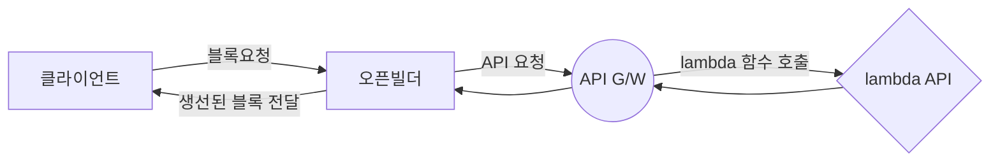

# RxJS 정리 프로젝트

> 서적 [RxJS 반응형 프로그래밍] 을 정리하려고 만든 프로젝트였으나 책이 무슨말하는지 하나도 못알아듣겠어서 스스로 자료찾아 학습후 정리한다. 매번 쓸때마다 차이점이 조금씩 헷갈리는 operator나 Subject를 정리한다!

## Share, ShareReplay

```mermaid
graph LR
A[클라이언트] -- 블록요청 --> B[오픈빌더]
B -- API 요청 --> C((API G/W))
C -- lambda 함수 호출 --> D{lambda API}
D --> C
C --> B
B -- 생선된 블록 전달 --> A
```