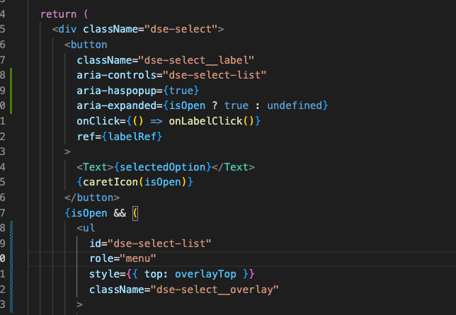

# Advanced React For Enterprise: React for senior engineers

- [Advanced React For Enterprise: React for senior engineers](https://www.udemy.com/course/react-for-senior-engineers/) 강의 정리
- React로 Design System을 구축하는것을 학습한다.

# 1. Introduction to Design System

## 1.1 What are Design Systems

- 디자인 시스템은 중복성을 줄이면서 다양한 페이지와 채널에서 공유 언어와 시각적 일관성을 만들어 대규모로 디자인을 관리하기 위한 일련의 표준이다. 여러 플랫폼/서비스에서 시각적 일관성을 만들어 사용자들에게 하나의 서비스라는 안정감과 신뢰감을 줄 수 있다.
- 참고 글 : [Design Systems 101](https://www.nngroup.com/articles/design-systems-101/#:~:text=Summary%3A%20A%20design%20system%20is,across%20different%20pages%20and%20channels.)

<br>

## 1.2 Atomic Design Principals

- [Atomic Design](https://bradfrost.com/blog/post/atomic-web-design/#atoms)은 디자인 시스템을 만들기 위한 하나의 방법론이다.
- 컴포넌트 요소를 독립적으로 존재할 수 있는 가장 작은 단위로 분리하고 이를 조합해서 사용한다.
- 가장 작은 요소부터 `Atom` < `Molecules` < `Organisms` < `Templates` < `Pages` 순으로 커진다.
  - `Atom` : 예를 들면 버튼이 있다. 버튼은 더 쪼갤 수 없다.
  - `Molecules`: Atom의 조합으로 만들어진 요소. 예를들면 Input + Label 같은 것들이 있다.
  - `Organisms`: Molecules의 조합으로 만들어진 요소/유기체. 예를들어 Navbar, Footer 같은 것들이 있다.
  - `Templates`: 하나의 페이지 템플릿을 의미한다. Page와의 차이는 데이터의 유무로, 템플릿에 데이터를 넣으면 Page가 된다.
  - `Pages` : 우리가 웹페이지에서 보는 하나의 페이지가 되겠다.

<br>

- [아토믹 디자인 규칙](https://maeng2418.github.io/react/atomic_design/#%EC%95%84%ED%86%A0%EB%AF%B9-%EB%94%94%EC%9E%90%EC%9D%B8-%EA%B7%9C%EC%B9%99)
  - 원자에 margin이나 position과 같은 위치에 영향을 주는 속성을 지정하지 않는다. (페이지내에서 사이드 이펙트를 일으킬 수 있음)
  - 컴포넌트들은 상태를 가지지 않아야 한다.
  - 오직 분자나, 유기체만이 원자들의 위치를 지정할 수 있으며 마찬가지로 자기 자신의 position과 margin을 지정해선 안된다.
  - 템플릿은 오직 그리드만을 가져야하고, 특정 컴포넌트의 위치를 지정해선 안된다.
  - 템플릿위에 컴포넌트를 렌더링하여 페이지를 완성시킨다.
  - 변수를 모아두는 파일(테마나 색상 변수값들)을 만들고 모든 아토믹 컴포넌트가 이 변수를 사용하게끔 만든다.

<br>

## 1.3 Example Design System

- 유명한 디자인 시스템에는 [Carbon Design System(IBM)](https://carbondesignsystem.com/), [Fluent UI(MS)](https://developer.microsoft.com/en-us/fluentui)등이 있다.
- 별건 없고, 이게 디자인 시스템을 만들 때 좋은 지표가 될 수 있기 때문에 잘 참고해야 한다. 각 디자인 시스템의 철학이나 코드 레벨에서의 구현, Doc의 구성 등을 비교해가며 참고하고, 모두 오픈소스로 깃헙 레포지토리에서 관리되고 있으므로 코드를 참고해본다.

<br>

## 1.4 Our role as an engineer in a design system

- 디자인 시스템을 구축하는데서 개발자의 역할은 디자인 철학과 가이드라인을 이해하고 이를 재사용 가능한 코드로 바꾸는 것이다. 디자인 시스템을 보고 재사용 가능한 데이터를 뽑아내서 코드화 시켜야 한다.(예를들어 color pallete를 scss로 변수화 시킨다)

<br><br>

# 2. CSS Architecture

- Design System은 확장성(Scalability), 지속성(Mainainability)가 중요하다. 여기에 맞춰 CSS가 작성되어야 한다.
- [Design System on Figma](https://www.figma.com/file/EX8VxcTtAatzI2PBLb361g/designsystems.engineering?node-id=99%3A0)
- [Material Design Theme Kit Figma](<https://www.figma.com/file/dx7FPC2YajKFAdTW9D1jAZ/Material-Design-Theme-Kit-(Copy)?node-id=0%3A2304>)

## 2.1 CSS Architecture Checklist

- `Organised` : fixed code structure(일관된 코드 구조)
- `No specificity issues` : 한 컴포넌트의 CSS는 다른 컴포넌트의 CSS와 충돌하지 않아야 한다.
- `Atomic design principles`
- `Easy to understand`(comments, variables)
  - css 주석 관련하여 `VS Code CSS Comments` 플러그인의 규칙을 따른다.
- `Fully customizable / themeable`

<br>

### 2.2 scss

### 2.2.1 foundation

- [Material Design Theme Kit](<https://www.figma.com/file/dx7FPC2YajKFAdTW9D1jAZ/Material-Design-Theme-Kit-(Copy)?node-id=0%3A2>)의 Theme Overview를 참고하자.
- foundation에서 정의한 변수들은 가장 기본이 되는 변수들이다. 이를 `atoms/*.scss`에서 사용해서 atom 요소를 스타일링 할 것이다.
- SCSS IntelliSense 플러그인 설치
  - Scss에 대해 자동완성, 추천, hover, Go to 등의 기능을 제공한다.
- 정의할 파일
  - `_varibale.scss`: 가장 기본이 되는 변수(figma 파일 foundation에 정의)
  - `_colors.scss`: color 변수
- 가장 기본이 되는 `_variable.scss`를 제외하고, 이를 사용하는 `_colors.scss` 등의 변수는 모두 css varibale을 사용한다. 이유는 scss를 사용하지 않는 사용자가 커스터마이징 할 수 있어야 하기 때문.

```scss
// scss로 정의, css로는 커스터마이징 할 수 없다.
$body-text-color: $dark;

// css varibale 사용
// --dse같은 prefix를 붙여서 다른 css 변수와 겹치지 않게 한다.
$body-text-color: var(
  --dse-body-text-color,
  $dark
) !default;
```

- `!default`의 의미는 해당 변수가 [어디선가 먼저 정의되지 않았을 경우에만 값을 할당한다는 의미.](https://stackoverflow.com/questions/10643107/what-does-default-in-a-css-property-value-mean)
- 커스터마이징은 scss 사용시 `$body-text-color`를 정의해서, css 사용시 `--dse-body-text-color`를 정의해서 할 수 있다.

### 2.2.2 colors

- color 관련된 변수를 설정한다. 기본이되는 `text-color`, `bg-color`, Button이나 Input등 요소의 `color`, `hover-color`, `focus-border`, `error-border`등의 컬러를 세부적으로 지정한다. `atom/*.scss`에서 파일에서 이걸 쓸것이다.

<br>

### 2.2.3 typography

- `font-family`, `font-size`, `font-weight`, `line-height`, `letter-spacing`등에 대한 정의가 필요하다. Body, Head로 분류할 수 있다. 상세한건 강좌에선 지정하지 않는다.

<br>

### 2.2.4 Mixins

- mixin에는 앱 전체에서 공통으로 사용될 수 있는 `reusable functionality`를 정의한다.

  - 각 break point별 Media query 정의하는 mixin
  - 사전 정의한 spacing skill을 사용하도록 강제하는 spacing mixin(margin, padding)

- mixin 정의 및 사용은 [`Scss Mixin`](https://sass-lang.com/documentation/at-rules/mixin)을 참고하자.
- mixin 작성시 [Scss Map](https://sass-lang.com/documentation/values/maps)을 사용했다. 매우유용하다. Getter 함수 문법이 강의와 공식문서가 다른데 강의는 [`map-get($map, $key)`](https://m.blog.naver.com/PostView.naver?isHttpsRedirect=true&blogId=phlox__&logNo=221181093967), 공식문서는 [`map.get($map, $key)`](https://sass-lang.com/documentation/modules/map#get)문법을 쓴다.
- 강의에서는 spacing관련하여 `padding`, `margin` 두개만 정의했는데 이걸 `margin-top`, `padding-left`과 같이 세부적으로 만들수도 있다.

> ❗️ SCSS의 `@mixin`은 overloading이 안된다.


<br>

### 2.2.5 Global

global 에서는 `foundation`과 `base`를 정의한다.

- `foundation` : foundation에 정의한 전체 scss를 import한다
- `base`: 기본이 되는 css 설정(e.g. Root Variable 정의, Reset Browser CSS)
  - Reset CSS는 [normalize-scss](https://www.npmjs.com/package/normalize-scss) 패키지를 사용한다.
  - \_root에는 `--dse-body-text-color`와 같이 root css variable을 정의한다. 이 때 scss 변수를 css 변수에 할당하는데, 아래와 같은 문법으로 작성해야 한다.
  ```
  # 문법
  --css-variable-name: #{$SCSS_VAR}
  ```
  ```scss
  :root {
    --dse-body-text-color: #{$dark};
    ...
  }
  ```

> 🧐 굳이 root variable을 왜 정의하는건지 모르겠다. 어차피 `$body-text-color: var(--dse-body-text-color, $dark) !default;`같은 형태로 정의했기 때문에 css 변수값이 없으면 자동으로 scss 변수가 사용될텐데. [css var](https://developer.mozilla.org/en-US/docs/Web/CSS/Using_CSS_custom_properties#custom_property_fallback_values)

<br>

### 2.2.6 Stylelint

- CSS, SCSS 의 코드베이스 통일을 위해 [`Stylelint`](https://stylelint.io/)를 사용한다. Prettier도 사용한다. ESLint + Prettier 사용하는 원리와 똑같다.

```bash
yarn add --dev stylelint stylelint-config-prettier stylelint-config-sass-guidelines stylelint-prettier
```

```json
{
  "scripts": {
    "lint": "stylelint './**/*.scss'",
    "lint:fix": "yarn lint --fix"
  }
}
```

<br>

### 2.2.7 husky, lint-staged 적용

- [`husky`](https://www.npmjs.com/package/husky)는 git hook으로, 특정 git action 발생시 정해진 로직을 수행하도록 도와준다. after/befor commit, pull, push 등에 사용할 수 있다.
- [`lint-staged`](https://www.npmjs.com/package/lint-staged)은 staged 된 파일에 대해 lint를 수행한다. 내부적으로 `husky`를 사용한다고 한다.
- 설치

```bash
yarn add --dev husky lint-staged
```

- `package.json` 설정

```json
{
  "husky": {
    "hooks": {
      "pre-commit": "lint-staged"
    }
  },
  "lint-staged": {
    "*.scss": "yarn lint:fix"
  }
}
```

- commit 시도 발생시 \*.scss에 대해 lint:fix 스크립트를 수행하고 오류가 있으면 commit을 중단한다.

- 이거 root 폴더가 아니면 작동하지 않는것같다. 테스트필요함

<br>

### 2.2.8 Compile SCSS to css

- [`node-sass`](https://www.npmjs.com/package/node-sass)를 이용해서 `global.scss`를 css로 컴파일한다. 사용자가 원하면 scss를 가져다 쓸수도 있긴 하나, css도 제공해야한다.

> 참고로 강좌에서와 같이 `node-sass`를 v4로 설치하면 gyp ERR!... 메시지가 뜬다. 정확한 원인은 모르고, v7로 업데이트 하면 해결가능

- 패키지 설치

```bash
yarn add -dev node-sass
```

- 공식 문서를 참고해서 빌드 스크립트를 작성한다.

```js
// src/scripts/build.js
const fs = require("fs");
const path = require("path");
const sass = require("node-sass");

// 컴포넌트 파일 가져오기
const getComponents = () => {
  let allComponents = [];

  const types = ["atoms", "molecules", "organisms"];

  types.forEach((type) => {
    const allFiles = fs
      .readdirSync(`src/${type}`)
      .map((file) => ({
        input: `src/${type}/${file}`,
        output: `lib/${file.slice(0, -4)}css`,
      }));

    allComponents = allComponents.concat(allFiles);
  });

  return allComponents;
};

// filpath를 컴파일하여 filename에 결과 생성
const compile = (filePath, filename) => {
  const result = sass
    .renderSync({
      data: fs
        .readFileSync(path.resolve(filePath))
        .toString(),
      outputStyle: "expanded",
      includePaths: [path.resolve("src")],
    })
    .css.toString();

  fs.writeFileSync(path.resolve(filename), result);
};

// 컴포넌트 컴파일
getComponents().forEach(({ input, output }) => {
  console.log(input, output);
  compile(input, output);
});

// global 컴파일
compile("src/global.scss", "lib/global.css");
```

```json
// package.json
{
  "scripts": {
    "build": "node src/scripts/build.js"
  }
}
```

<br>

> ❗️추가적으로, `stylelint`가 기본적으로 css로 린트하는데, stylelint plugin에서 쓸데없는 에러가 많이 난다. 설정에서 빌드 결과물은 제외시키자.

```json
{
  "ignoreFiles": ["./lib/*.css"]
}
```

<br><br>

# 3. Monorepositories
> [`lerna`](https://www.npmjs.com/package/lerna)를 이용해 mono-repo를 구축한다.
> 참고 자료 : https://kdydesign.github.io/2020/08/25/mono-repo-lerna/

<br>

## 3.1 Multi-Repo vs Mono-Repo
1. Multi-Repo
- 여러 패키지들을 각각의 Repository에 분산해서 관리하는것을 말한다.
- 장점
  - Repository별 Owner를 지정할 수 있다.
  - 빠른 CI Build
  - 패키지의 명확한 분리로 인한 유연성 향상 : 의존 Repository와 분리되어 있기 때문에 유지보수에 있어 유연성 향상
- 단점
  - 중복된 설정 및 반복된 설치(e.g. eslint, babel)
  - 이슈의 분산 : 별개의 Repository들로 관리되므로 이슈 트래킹도 별도로 가진다. `CHANGELOG`도 분리된다.
  - Dependency Hell : 의존성이 복잡해진다. 같은 모듈을 쓰는 패키지들이 버전 차이에 따라 종속성이 달라지고 이로 인한 충돌을 야기할 수 있다.
  - 공통된 코드의 중복

<br>

2. Mono-Repo
- 여러 패키지들을 하나의 Repository에서 관리하는것을 의미한다.
- 장점
  - 공통 항목의 단일화 : `lint`, `build`, `test`등 공통된 설정 및 `node_module`을 한번의 설치와 한번의 설정으로 모든 패키지가 공유한다.
  - 쉬운 Package 공유 : 패키지가 분산되어 있지 않기 때문에 Package간의 코드 공유가 매우 수월하다.
  - 단일 이슈 트래킹
  - 효율적인 의존성 관리

- 단점
  - Repository의 거대화
  - 느린 CI Build
  - 무분별한 의존성 : Package간 의존성 관리가 쉽다는 장점이 있지만, 오히려 이로 인해 과도한 의존 관계가 발생할 수 있다.
  - Dev Tools의 인덱싱 저하 : Mono-Repo를 하나의 개발 도구로 열 경우 해당 Package의 인덱싱 속도가 느려진다.

<br>

Mono-Repo는 아래의 조건을 만족하는 프로젝트에서 사용하면 좋다.
  1. 서로 다른 패키지가 연관 관계를 가질 경우
  2. 첫 번째 항목이 고려된 상황에서 N개의 패키지의 형태와 목적이 유사한 경우
  3. 두 번째 항목이 고려된 상황에서 N개의 패키지 중 배포되어야 할 패키지의 비중이 큰 경우

<br>

### 3.2 Lerna
- [`Lerna`](https://www.npmjs.com/package/lerna)는 Mono-Repo 패키지를 관리하기 위한 CLI 도구다. 
- 주요 기능은 아래와 같다
  1. Fixed Mode
      - 다중 패키지의 버전이 단일 버전 라인에서 작동하며 관리
      - 버전은 Root에서 관리되며, `learna publish`할 경우 새 버전으로 패키지 게시
      - ***하나의 패키지가 수정되더라도 모든 패키지는 새로운 버전을 개시***
  2. Independent Mode
      - 패키지의 유지 관리자가 서로 독립적으로 패키지 버전을 관리
      - lerna publish시 변경된 패키지에 대해서만 새 버전을 업데이트
      - 버전은 각 패키지의 `package.json`에 명시
  3. Hoisting
      - 다중 패키지에서 사용되는 node module을 최적화하여 중복되는 node module을 최상위 경로로 재구축
      - 공통 종속성을 최상위 수준에서만 설치되며 개별 패키지는 생략
    

  4. Yarn Workspace
      - Yarn WorkSpace는 여러 패키지를 하나의 패키지에서 관리하게 해준다.
      - ***Yarn WorkSpace를 통해 각 패키지는 서로 참조하는 연관 관계를 가질 수 있다.*** 
      - npm도 v7부터 workspace를 도입했다고 한다.
- 가장 주요 명령어는 아래와 같다.
  1. `lerna clean`: Root를 제외한 package의 node_modules 제거
  2. `lerna bootstrap`: 모든 패키지의 node_modules 설치
  3. `lerna run`: 각 패키지의 package.json에 명시된 script를 실행
  4. 그 외 : https://github.com/lerna/lerna/tree/main/commands

<br>

### 3.3 Setup
- core package 설치 및 초기화
```bash
yarn init
yarn add -dev lerna
yarn lerna init
```
- `package.json`에 아래 내용을 추가한다.
```json
{
  "private": true,
  "workspaces": {
    "packages": [
      "packages/*"
    ],
    "nohoist": ["**/normalize-scss"]
  }
}
```
- private은 core 패키지가 publish 되지 않고 하위 패키지를 관리하는 용도임을 명시한다.
- workspace 옵션은 lerna에서 사용할 옵션으로 보인다. `packages`는 하위 패키지들이 있는 위치, `nohoist`는 하위 패키지 의존성중 호이스팅(core에 설치)시키지 않을 패키지를 의미한다.

> `normalize-scss`는 호이스팅이 안된다고한다. 이게 패키지 레벨에서 지원이 안되는건지, scss @import 로 사용해서 안되는건진 잘 모르겠다.

- `lerna.json` 에 아래 내용을 추가한다.
```json
{
  "npmClient": "yarn",
  "useWorkspaces": true,  // npmClient의 workspace(package.json에 정의)를 공유해서 사용한다.
  "stream": true  // stream 아웃풋을 디버깅 할 수 있게 출력
}
```

> [package.json의 workspace관련 설정 ([npm](https://docs.npmjs.com/cli/v8/configuring-npm/package-json#workspaces), [yarn](https://yarnpkg.com/configuration/manifest#workspaces))과 [lerna.json의 설정](https://github.com/lerna/lerna#lernajson)에 관련해서는 강의의 내용에 대해서는 공식문서에서 찾을 수가 없다. 따라서 대략적으로 추론하여 정리함.

- 모든 node_modules 폴더를 지우고 루트에서 `yarn`을 입력해서 다시 설치해보자. 아래와 같이 설치된다.
```bash
node_modules/ # @ds.e/scss 를 포함한 모든 의존성 설치(호이스팅)
packages/scss/node_modules/ # ./bin/ : symlink들, 이외 의존성 설치되지 않음
```
- yarn은 개발중인 패키지의 의존성을 호이스팅하여 root 폴터로 집어넣는다.(중복은 제거된다)
- core의 package.json에 build script를 작성한다.
```json
{
  "scripts": {
    "build": "yarn lerna run build"
  }
}
```
- 해당 스크립트는 모든 하위 패키지에서 `yarn build`를 실행한다.

<br>

> [`yarn workspace`](https://classic.yarnpkg.com/lang/en/docs/workspaces/),[hoist의 개념과 nohoist가 필요한 이유](https://classic.yarnpkg.com/blog/2018/02/15/nohoist/) 등에 대해 완전히 이해하지 못했다. 링크를 찬찬히 다시 읽어보자.

<br>
> [`yarn workspace`](https://classic.yarnpkg.com/lang/en/docs/workspaces/),[hoist의 개념과 nohoist가 필요한 이유](https://classic.yarnpkg.com/blog/2018/02/15/nohoist/) 등에 대해 완전히 이해하지 못했다. 링크를 찬찬히 다시 읽어보자.

<br>

# 4. Implementation of React
- mono repository는 react, angular, vue 등 여러 프레임워크에 대해 각각의 패키지를 만들어서 관리할 수 있다. 이 중 react를 만든다.
- 설치
```bash
yarn add --dev react@^17.0.0 @types/react@^17.0.0 typscript 
```

<br>

## 4.1 Foloder Structur
- 기본적으로 아래 folder 구조로 작업한다. 일부만 표현해본다.
```
react/
  src/
    atoms/
      Button/
        Button.tsx
        index.ts
    foundation/
    molecules/
    index.ts    
```
```ts
// Button.tsx
const Button: React.FunctionComponent<ButtonProps> = ({ label }) => {
  return <button>{label}</button>
}

export default Button;

// Button/index.ts
export { default } from './Button';

// index.ts
import Button from './atoms/Button';

export { 
  Button
}
```
- 이런식으로 모듈 내부 구현 파일과 사용자가 모듈을 사용할 수 있도록 export하는 파일을 분리하는걸 [**모듈 다시 내보내기**](https://ko.javascript.info/import-export#ref-543)라고 한다. 이렇게 하면 ***패키지의 세부 구현을 숨겨 사용자가 건드리지 못하게 하고, 사용하는 부분만 사용자에게 공개할 수 있다.***

<br>

## 4.2 Add rollup to compile react
- 설치
```bash
yarn add --dev rollup rollup-plugin-typescript2
```
> 타입스크립트 컴파일에 `rollup-plugin-typescript2`이 많이 쓰이긴 하는데  `@rollup/plugin-typescript`로 가지 않을까 싶다. 후자는 rollup의 공식 플러그인이기 때문이다.

- `rollup.config.js`
```js
import Ts from 'rollup-plugin-typescript2';
 
export default {
  input: [
    'src/index.ts',
    'src/atoms/Button/index.ts'
  ],
  output: {
    dir: 'lib',
    format: 'esm',
    sourcemap: true
  },
  plugins: [Ts()],
  preserveModules: true,  // preserve the structure of source folder
  external: ['react'] // 외부 모듈
}
```
- `input`: 옵션에 명시된 파일은 `index.js`를 빌드해 외부에서 사용할 수 있게된다. 예로 `..Button/index.ts`가 없으면 버튼의 index.js는 번들링 결과로 생성되지 않고, 루트 index에를 import해서 써야만 하게 된다.
- `preserveModules`: 우리가 작성한 폴더(모듈)구조를 번들링 결과물에 그대로 반영한다. 하지 않으면 js파일이 output.dir인 lib/에 죄다 생성된다.
- `external`
  - 외부 모듈(`yarn add` 로 설치한)은 rollup에서 기본적으로 번들링 결과에 포함시키지 않기 때문에 찾지 못한다. 어차피 사용하는 쪽에서 `npm i`로 설치하면 package.json을 읽어서 필요한 외부모듈을 설치하기 때문에 문제는 없으나, rollup으로 번들링시 wanrinig이 발생하는데, `external`에 사용하는 외부 모듈을 명시해주면 된다.
  - 번들링 결과물에 외부 모듈을 포함시키려면 [@rollup/plugin-node-resolve](https://github.com/rollup/plugins/tree/master/packages/node-resolve)를 쓰면 된다고 한다.
  - [rollup warning link](https://rollupjs.org/guide/en/#warning-treating-module-as-external-dependency), [rollup.js 플러그인 가이드](https://www.peterkimzz.com/rollupjs-using-plugin/) 자료를 참고하자.

<br>

- `package.json`에 빌드 스크립트를 추가하고 main을 번들링 결과로 변경한다.
```json
{
  "main": "lib/index.js",
  "scripts": {
    "build": "rollup -c"
  }
}
```

<br>

## 4.3 Setup a React playground
- `playground`는 디자인 시스템을 사용하여 샘플 앱을 만듦으로서 개발한 디자인 시스템을 테스트한다. 배포되는 용도는 아니다.
- playground는 번들러로 [parcel](https://parceljs.org/getting-started/webapp/)을 사용한다. 이유는 zero-config로 간단하게 사용이 가능하기 때문으로 추측된다.
- 필요 패키지 설치
```bash
yarn add --dev react@^17.0.0 @types/react@^17.0.0 react-dom@^17.0.0 @types/react-dom@^17.0.0 typescript parcel
```
자

> ❗️ 책에서는 `parce-bundler`를 설치하는데 이건 v1으로 deprecated 되었다. [v2 인 parcel로 migration](https://parceljs.org/getting-started/migration/) 해야한다. 기본적으로 `<script>` 태그에 `type="module"`옵션을 추가해줘야 하도록 변경되었다.

> ❗️❗️ 번들러를 많이 쓴다. [[포스팅] `webpack` vs `rollup` vs `parcel`](https://velog.io/@subin1224/Parcel-vs-Rollup-vs-Webpack-%EB%B9%84%EA%B5%90)에 따르면 복잡한 설정을 피하고 간단한 애플리케이션을 빠르게 만들고 싶다면 `Parcel`, 최소한의 서드파티로 라이브러리를 만들고 싶다면 `Rollup`, 많은 서드파티를 필요로 하는 복잡한 애플리케이션 에는 `Webpack`을 사용하라고 한다. 여기에 맞게 번들러를 사용하고 있는걸로 보인다.

<br>

- parcel은 entrypoint js 파일 없이, html을 바로 serve한다. 이에 맞춰 index.html과 index.tsx를 작성한다.
```html
<!-- index.html -->
<!DOCTYPE html>
<html lang="en">

<head>
  <meta charset="UTF-8">
  <meta http-equiv="X-UA-Compatible" content="IE=edge">
  <meta name="viewport" content="width=device-width, initial-scale=1.0">
  <title>Playground React</title>
</head>

<body>
  <div id="root"></div>
  <script src="index.tsx" type="module"></script>
</body>

</html>
```
```tsx
import React from 'react';
import ReactDOM from 'react-dom';

import { Button } from '@ds.e/react'

import '@ds.e/scss/lib/Button.css'

ReactDOM.render(
  <Button label='Playground Button'/>,
  document.querySelector('#root')
)
```
- `tsconfig.json`파일을 작성한다.(생략)
- `package.json`에 serve 스크립트를 추가하고 실행해본다.
```json
{
  "scripts": {
    "dev": "parcel src/index.html -p 3000"
  }
}
```
```
yarn dev
```
- 결과물이 잘 번들링되어 실행됨을 알 수 있다. 신기하게도 `loader`나 `plugin` 없이도  `typescript`도 알아서 컴파일해주고, `css 모듈`같은것들도 알아서 다 번들링해준다.

<br>

## 4.4 Setup dev scripts for all packages
- 개발 편의를 위해 playground 실행과 design-system 패키지들의 build + watch 를 동시에 실행할 수 있는 `dev` 스크립트를 작성한다.
- `@ds.e/react`의 rollup이나 `@playgroud/react`의 parcel은 모두 watch모드를 지원한다. 직접 빌드스크립트를 만든 `@ds.e/scss`는 [`nodemon`](https://www.npmjs.com/package/nodemon)을 사용한다. 아래와 같은 옵션을 쓴다.
  - `--watch` : watch할 디렉토리를 정할 수 있다. `--watch src` 하면 src 이하 모든 파일을 watch한다.
  - `--exec`: watch할 파일에 변화가 감지되면 실행할 명령어를 지정한다.
  - `-e --ext`: watch할 파일의 extension을 정할 수 있다. `-e scss` 하면 scss파일만 watch한다.

- 각 패키지의 ***`dev script`는 아래와 같다.***
```bash
# @ds.e/scss  
nodemon --watch src --exec yarn build -e scss
  
# @ds.e/react
yarn build --watch

# @playgroud/react
parcel src/index.html -p 3000
```
- ***Root 패키지에서 `lerna`를 이용해 이걸 전부 실행시킨다.***
```json
// package.json
{
  "scripts": {
    "dev": "yarn lerna run dev"
  }
}
```
- ***design-system의 각 파일이 수정되면, 다시 빌드되고, 해당 내용을 playground에서 import해서 사용중이라면, playgroud도 다시 빌드된다.***

<br>

## 4.5 Indentify atoms, molecules and organisms

- `Selectbox`컴포넌트를 개발한다. `Selectbox`의 디자인을 보고 어떤 `atoms`, `molecules`, `oranisms`로 구성되는지 분석하고, 이걸 카테고리화 시켜야한다.
  - selectbox(organisms)
    - select item(w state selected, `molecule`)
      - sqaure box(`atom`)
      - color component(`atom`)
      - text component(white/color)(`atom`)
      - icon(dropdown, check `atom`)

<br>

## 4.6 Color Atom

- color 컴포넌트는 디자인 시스템상에 네모난 컬러 컴포넌트다. 색상값인 `hex`를 인자로 받고, 사이즈인 `width`, `height`도 인자로 받는다. 이 때, ***컴포넌트의 사이즈는 디자인 시스템 variable의 `$spacing`에 정의된 값만 사용하도록 만들어야한다.*** 
- 이를 위해 `$spacing`을 이용해 `dse-{width|height}-{size}` 형태의 클래스를 정의해야한다.
```scss
// @ds.e/scss, atoms/Utilities.scss
@import "foundation/all";

@each $size, $value in $spacing {
  .dse-width-#{$size} {
    width: $value;
  }

  .dse-height-#{$size} {
    height: $value;
  }
}
```
- 이 파일을 컴파일하면 아래와 같은 형태의 css파일이 만들어진다. 

```css
/* Utilities.css */
.dse-width-xxxs {
  width: 0.25rem;
}

.dse-height-xxxs {
  height: 0.25rem;
}

/* ... */
```
> ❗️ scss 빌드시 node-sass의 `includePaths`에 src를 추가해서 위의 `@import "foundation/all"`는 `src/foundation/_all.scss`를 임포트하게 된다. 근데 vscode상에서는 이를 인식하지 못하는데, 이걸 해결할 방법을 찾지 못했다. live sass compiler 플러그인에도 따로 설정할 수 없고, scss로 인식도 못해 `@import "../foundation/_all.scss"`를 해야 링크이동이 가능하다. 원인 미상.

<br>

- 위 클래스를 사용할 수 있게 spacing 변수를 상수화 시킨다.
```ts
// @ds.e/react foundation/Spacing.ts

const spaces = {
  xxxs: "xxxs",
  xxs: "xxs",
  xs: "xs",
 // ...
}

export default Object.freeze(spaces);
```
- 이 모듈을 디자인 시스템에서 아래와 같이 적용할 수 있다.
```tsx
// atom/Color.tsx
import React from "react";
import Spacing from "../../foundation/Spacing";

interface ColorProps {
  hexCode: string;
  width?: keyof typeof Spacing;
  height?: keyof typeof Spacing;
}

const Color: React.FunctionComponent<ColorProps> = ({
  hexCode,
  width = Spacing.sm,
  height = Spacing.sm,
}) => {
  const className = `dse-width-${width} dse-height-${height}`;
  // ...
}
```
- `playground`에서는 `import "@ds.e/scss/lib/Utilities.css";`로 css를 임포트하고 컴포넌트를 사용하면 된다.

- Text atom도 이와 같은 방식으로 만든다.(생략)
<br>

## 4.7 Foundation 분리
- 스프링에서 multi-module 프로젝트를 만들어 도메인들을 모두 분리했던 것 처럼 디자인 시스템의 `foundation js파일`들도 패키지로 분리해, 여러 다른 패키지(react, vue, angular..)에서 재사용 할 수 있다.
- `@ds.e/foundation` 패키지를 만들고 타입스크립트를 설치한다. 번들러 같은건 없으며, `tsc`로 컴파일한다.
- `tsconfig.json`파일을 아래와 같이 작성한다. 설정은 많진 않고, 이 패키지는 다른 패키지에서 reference 되어 사용되므로, `"composite": true`와 `"rootDir": "src"`설정은 필수다.
```json
{
  "compilerOptions": {
    "outDir": "lib",
    "module": "ESNext",
    "target": "ESNext",
    "rootDir": "src",
    "declaration": true,
    "composite": true,
    "moduleResolution": "node",
  },
  "include": [
    "src"
  ],
  "exclude": [
    "node_modules",
    "lib"
  ]
}
```
- `build`와 개발시 사용할 `dev` 스크립트를 작성하고 앱 진입점을 설정한다. 
```json
// package.json
{
  "main": "lib/index.js",
  "scripts": {
    "build": "tsc",
    "dev": "yarn build --watch"
  }
}
```
- `@ds.e/foundation`를 사용하는 쪽에서는 tsconfig에 아래와 같은 내용을 추가해주면 된다.
```json
// tsconfig.json
{
  "references": [
    {
      "path": "../foundation"
    }
  ]
}
```
- `rollup`을 사용하는 패키지에서는 rollup config의 외부 모듈에 `@ds.e/foundation`을 추가해야 경고메시지가 안뜬다.
```js
// rollup.config.js
export default {
  // ...
  external: ["react", "@ds.e/foundation"]
};
```

<br>


## 4.8 Spacing Component
- 마진 등의 spacing을 따로 컴포넌트로 분리하여 작성한다. `<Margin>{children}</Margin>`형태로 작성할 것이다.
- 이 때 className은 `dse-margin-[,direction]-{size}`형태로 사전에 정의되어야 한다. scss를 이용하면 쉽게 만들수 있다.
```scss
// @ds.e/scss atom/Margin.scss
@import "foundation/all";

$sides: left, right, top, bottom;

@each $space, $value in $spacing {
  // 기본 마진
  .dse-margin-#{$space} {
    margin: $value;
  }

  // 방향별 마진
  @each $side in $sides {
    .dse-margin-#{$side}-#{$space} {
      margin-#{$side}: $value;
    }
  }
}
```

- Margin 컴포넌트를 작성한다. 컴포넌트는 `마진의 사이즈`와 `마진의 방향`을 인자로 받을것이다.
```tsx
// @ds.e/react atoms/Margin.tsx

// ...
interface MarginProps {
  space?: keyof typeof Spacing;
  left?: boolean;
  right?: boolean;
  top?: boolean;
  bottom?: boolean;
}

const Margin: React.FunctionComponent<MarginProps> = ({
  space = Spacing.xxxs,
  left,
  right,
  top,
  bottom,
  children,
}) => {
  let className = "";

  if (!left && !right && !top && !bottom) {
    className = `dse-margin-${space}`;
  }
  if (left) {
    className += ` dse-margin-left-${space}`;
  }

  if (right) {
    className += ` dse-margin-right-${space}`;
  }

  if (top) {
    className += ` dse-margin-top-${space}`;
  }

  if (bottom) {
    className += ` dse-margin-bottom-${space}`;
  }

  return <div className={className}>{children}</div>;
};
```
- 약간의 노가다가 필요하다. 방향을 설정하지 않으면 className은 `dse-margin-${space}`이고 방향을 정의하면 `dse-margin-${side}-${space}`를 개별적으로 추가해준다.
- 사용법은 아래와 같다.
```tsx
// @playground/react
ReactDOM.render(
  <>
    <Margin left space="none">
      <Text size="xs">텍스트 컴포넌트 테스트</Text>
    </Margin>
  </>,
  document.querySelector("#root")
);
```
- Margin 컴포넌트의 children으로 Text 컴포넌트를 넣은것이다. 여기서 중요한건 ***마진은 마진 컴포넌트로만 추가할 수 있기 때문에 다른 모든 atoms 요소들은 전부 마진이 0이어야 한다는 것***이다.
- 이를 위해 Text 컴포넌트는 `.dse-text`를 기본적으로 추가한다.
```tsx
// @ds.e/react atoms/Text.tsx
const Text: React.FunctionComponent<TextProps> = ({
  size = FontSize.base,
  children,
}) => {
  const className = `dse-text dse-text-${size}`;
  return <p className={className}>{children}</p>;
};
```
```scss
// @ds.e/scss atoms/Text.scss
.dse-text {
  margin: 0;
}
```

- padding과 같은 다른 요소에 대해서도 동일하게 적용할 수 있을것으로 보인다.

<br>

## 4.9 Select molecule
- component basic
- component style
  - molecule의 css작성은 매우 중요하다. `reusable`, `maintainability`, `best practice`를 따라야 한다.
  - 이 때 가급적이면 `@mixin`이나 `_variable.scss`의 변수를 사용해 만든 변수값을 사용해야 한다. 
    ```scss
    .dse-select {
      // ...
      
      &__label {
        // padding: map-get($spacing, $key: "xs"); 을 mixin으로 분리
        @include padding("xs");
        
        // $form-border-color를 사용하면 사용자가 css변수를 선언해서 해당 색상을 customizing 할 수 있게 된다.
        border: 1px solid $form-border-color;
        background: $form-bg-color;

        // ...
      }
    }
    ```
  - css 적용시 className 작성은 [BEM](https://zzemal.tistory.com/88#:~:text=Bem%20%EC%9D%80%20Block%20Element%20Modifier,%EB%84%A4%EC%9D%B4%EB%B0%8D%EC%9D%84%20%ED%95%9C%EB%8B%A4%EB%8A%94%20%EC%9D%98%EB%AF%B8%EC%9D%B4%EB%8B%A4.)을 따르면 좋은 것 같다.
  - ***❗️❗️ select box의 option은 자바스크립트로 객체의 높이를 계산한 후 옵션 컨테이너(`<ul>`)에 top 스타일을 동적으로 할당해서 구현한다.***(이걸 몰라서 예전에 css calc로 노가다를 했었다..)

  - Select 버튼에 svg 넣기
    - [heroicons](https://heroicons.com/)에서 필요한 아이콘 찾는다.
    - jsx copy
    - 그대로 import
  - Select box의 shadow는 scss map으로 정의된 변수를 사용했다. shadow도 보통 정해진 값들이 있고 이를 재사용 한다고 한다.
  - 유저가 shadow를 커스터마이징 할 수 있게 하고 싶으면 foundation에 css 변수로 프록시 변수를 정의하면 된다.(여기선 하지 않았다.)

<br>

## 4.10 Select Component With Render Props(38강)
- [Render Props](https://ko.reactjs.org/docs/render-props.html#gatsby-focus-wrapper) 패턴을 이용해서 Select 컴포넌트의 option에 랜더링 될 요소를 사용자가 커스터마이징 할 수 있게 한다.

> 솔직히 좋은 패턴은 아닌 것 같다. [`Mui`](https://mui.com/material-ui/react-select/#main-content)에서는 Compound Component같은 패턴을 이용해서 구현했는데 이게 훨씬 직관적이다.

```tsx
// @ds.e/react  src/molecules/Select.tsx
interface RenderOptionProps {
  isSelected: boolean;
  option: SelectOption;
  getOptionRecommendedProps: (overrideProps?: Object) => Object;
}

interface SelectProps {
  // ...
  renderOption?: (props: RenderOptionProps) => React.ReactNode;
}
```
- 위와같이 `renderOption`을 optional하게 전달하도록 한다. 사전 정의한 `<li>`요소가 아닌 `renderOption 함수의 반환값`을 랜더링한다.
```tsx
// @ds.e/react  src/molecules/Select.tsx

const Select = () => {
  // ...
  return (
    // ...
    <>
      {options.map((option, optionIndex) => {
        const isSelected = selectedIndex === optionIndex;

        const renderOptionProps: RenderOptionProps = {
          isSelected,
          option,
          getOptionRecommendedProps: (overrideProps = {}) => {
            return {
              className: `dse-select__option ${
                isSelected ? "dse-select__option--selected" : ""
              }`,
              onClick: () => onOptionSelected(option, optionIndex),
              key: option.value,
              ...overrideProps,
            };
          },
        };
        if (renderOption) {
          return renderOption(renderOptionProps);
        }
        // else: <li>...</li>
      })}
    </>
  )
}
```
- 복잡해진다. 옵션 요소에 기본 정의한 `.dse-select__option`와 `onClick()`를 넣게 했고 사용자는 `overrideProps`를 전달해 이걸 override하게 했다. `onClick()`의 경우 강의의 방식은 잘못됐다. 아래와 같이 해야한다.


```tsx
const callFnsInSequence = (...fns) => (...args) => {
  fns.forEach(fn => fn && fn(...args))
}
const renderOptionProps: RenderOptionProps = {
  isSelected,
  option,
  getOptionRecommendedProps: (overrideProps = {}) => {
    return {
      className: `dse-select__option ${
        isSelected ? "dse-select__option--selected" : ""
      }`,
      key: option.value,
      ...{
        ...overrideProps, 
        onClick: callFnsInSequence(() => onOptionSelected(option, optionIndex), overrideProps.onClick)
      },
    };
  },
};
```
- 코드가 중첩 spread해서 좀 복잡해졌지만 이건 간소화 할 방법이 있을것이다. 아무튼 `callFnsInSequence`와 같은 방식으로 기본 함수도 호출하면서 overriding하게 해야 할 것이다.

> ***❗️❗️ Accessibility에서 `Render Porps`패턴을 쓰는 이유가 나온다. RenderProps 패턴을 쓰면 단순히 랜더링 하는것 이상으로 컴포넌트에서 해당 커스텀 요소들에 대한 여러가지 제어를 그대로 가지고 있을 수 있게 된다.***

<br>


# 5. Accessibility for the select component
- 크롬의 [Screen Reader Extension](https://chrome.google.com/webstore/detail/screen-reader/kgejglhpjiefppelpmljglcjbhoiplfn?hl=en)을 사용한다. 강의 녹화 당시에는 `ChromeVox`라는 이름이었나 보다.

## 5.1 popup aria attributes
- `aria-haspopup`: 해당 요소가 팝업 버튼인지 여부
- `aria-expanded`: 팝업이 펼쳐졌는지 여부, `boolean`, `undefined`(isOpend)
- `aria-controls`: 해당 요소가 제어하는 요소의 id값, button은 ul을 제어하므로 ul에 id를 할당하고 이 값을 button의 aria-controls에 할당한다.
- `role='meun'`: 해당 요소가 드롭다운 메뉴임을 알려줌. `<ul>`에 붙이자
- 최종적으로 아래와 같다.

  

<br>

## 🔥🔥 5.2 Control menu items with keybord
- 접근성 외에도 여러가지로 리액트에 대해 배울게 많은 장이다. 
- 웹 접근성을 위해 `click`대신 키보드로 Option을 열고, Mouse의 `hover`같은 기능(`highlight`, `focus`)을 구현하고 싶다.
1. click으로 옵션 열기
```tsx
// @ds.e/react Select.tsx

// ...
const Select = () => {

  const onButtonKeyDown: KeyboardEventHandler = (event) => {
    event.preventDefault();

    if (KEYS.includes(event.key)) {
      setIsOpen((prev) => !prev);
    }

    // 첫 번째 item을 highlight
    highlightItem(0);
  };

  return (
    <div className="dse-select">
      <button
        onKeyDown={onButtonKeyDown}></button>
      
      // ...
    </div>
  )
}

// ...

const KEYS = ["Enter", "ArrowDown", " "];
```
- 강의에서는 `event.keycode`로 했으나 이건 deprecated다. `event.key`를 사용하자.
-
- `highlight`는 아래와 같이 구현한다. ***우선 `li`요소에 대한 참조를 구해야한다!***
```tsx
const Select = () => {

  // option의 수만큼 React.createRef로 RefObject를 만든다.
  const [optionRefs, setOptionRefs] = useState<
    React.RefObject<HTMLLIElement>[]
  >([]);
  useEffect(() => {
    setOptionRefs(options.map((_) => createRef<HTMLLIElement>()));
  }, [options.length]);


  return (
    <div>
      // ...

      {isOpen && (
        <ul>
          {options.map((option, optionIndex) => {
            
            const ref = optionRefs[optionIndex];
            
            const renderOptionProps: RenderOptionProps = {
              getOptionRecommendedProps: (overrideProps = {}) => {
                return {
                  ref,  // 여기! 각 li요소에 optionRefs에서 가져온 ref를 맵핑했다!!!
                  // ...
                }
              }
            }
            return (
              <li {...renderOptionProps.getOptionRecommendedProps()}>
                // ...
              </li>
            );
          })}
        </ul>
      )}
    </div>
  )
}


```
- 동적인 요소에 대한 ref를 정의하고 랜더링과정에서 ref.current에 각각의 요소가 들어가도록 구현했다.
- 이제 이 요소들을 이용해서 focus/highlight가 어떤식으로 구현되는지 알아보자.
```tsx
const Select = () => {
  
  // ...
  const [highlightedIndex, setHighlightedIndex] = useState<number | null>(null);
  const highlightItem = (optionIndex: number | null) => {
    setHighlightedIndex(optionIndex);
  };
  // highlight 할 때(highlightedIndex 변경될때) focus까지 같이한다.
  useEffect(() => {
    if (highlightedIndex !== null && isOpen) {
      const ref = optionRefs[highlightedIndex];

      ref.current?.focus(); // focus: 스크린 리더의 focus 영역이 이동한다.
      console.log(ref.current);
    }
  }, [highlightedIndex, isOpen]);

  // ...
  return (
    <div>
      // ...

      {isOpen && (
        <ul>
          {options.map((option, optionIndex) => {
            const isHighlighted = highlightedIndex === optionIndex;
            const renderOptionProps: RenderOptionProps = {
              getOptionRecommendedProps: (overrideProps = {}) => {
                return {
                  ref,  // 여기! 각 li요소에 optionRefs에서 가져온 ref를 맵핑했다!!!
                  tabIndex: isHighlighted ? -1 : 0, // tabIndex:0이면 탭으로 focus를 이동하는게 가능하다. 기본 input같은 요소들은 tabIndex 지원됨
                  // :hover를 js로 구현한다.
                  onMouseEnter: () => highlightItem(optionIndex), 
                  onMouseLeave: () => highlightItem(null),
                  // 
                  className: `${isHighlighted ? "dse-select__option--highlighted" : ""}`,
                }
              }
            }
            return (
              <li {...renderOptionProps.getOptionRecommendedProps()}>
                // ...
              </li>
            );
          })}
        </ul>
      )}
    </div>
  )
}
```
- `tabIndex: 0`을 주면 focus 할 수 없는 요소에 대해서도 focus 할 수 있다. [tabIndex의 사용](https://nuli.navercorp.com/community/article/1132726)글을 참고하자. 유용하다.
- `isHighlighted`는 현재 optionIndex와 highlightedIndex를 비교해서 결정한다. 마우스 hover시 `highlightItem()`메서드로 `isHighlighted`값을 변경한다.
- `:hover`를 `dse-select__option--highlighted`로 바꾼것이기 때문에 scss의 :hover도 적절하게 바꿔준다.
```scss
// @ds.e/scss  Select.scss
.dse-select {
  // ...

  // 이전 : &:hover{ ...
  &--highlighted {
    background-color: $form-bg-color-hover;
  }
}
```

- 이번 장 정리
  - tabIndex 사용한 focus
  - css의 `:hover`를 `mouseEnter()`, `mouseLeave()`를 이용하여 구현
  - 동적인 요소들에 ref[]를 만들어 ref할당 - `React.createRef()`
  - 적절한 `useEffect`의 활용

<br>

### 5.3 Accessible keyboard navigation
- 키보드 방향키로 옵션의 focus + hover를 움직이고, enter로 어떤 옵션을 선택할 지 결정한다. 옵션 요소(`li`)에 `optionKeyDown` 이벤트 핸들러로 구현하였다.
- 그 외에 `role`, `aria-label`을 각 역할에 작성하였고, `aria-checked`로 스크린 리더가 어떤 요소가 선택되어 있는지 알 수 있게 하였다.

<br>


# 10. Issues
## 10.1 mono repository에서 패키지간 typescript module resolution 오류
- `@playground/react` 에서 `@ds.e/react`를 import 할 경우 모듈을 찾지 못한다는 에러를 볼 수 있다. 타입스크립트의 module resolution 시스템이 현재 모듈 구조를 인식하지 못하기 때문에 발생한다.
- 해결하기 위해서는 `@playground/react`의 tsconfig 에서 `@ds.e/react`프로젝트를 참조하도록 설정해줘야한다. 공통 설정 분리를 위해 `<root>/tsconfig.packages.json`를 만들고 하위 패키지에서 이를 상속한다.
```json
// tsconfig.packages.json
{
  "compilerOptions": {
    // ...
    "declaration": true,
    "composite": true,
  }
}
```
- 핵심은 `declaration`, `composite` 설정을 true로 해준다는 것이다. 패키지 사용자인 `@playground/react`에서 사용할 `@ds.e/react` 프로젝트를 reference 해준다.
```json
{
  "extends": "../../tsconfig.packages.json",
  "references": [
    {
      "path": "../../packages/react"
    }
  ],
  //...
}
```
- `@ds.e/react` 패키지는 아래와 같이 설정한다. 상속을 통해 `{ composite: true }`를 받아오는데, 이 설정은 rootDir를 설정하지 않으면 tscofing 파일이 있는 디렉토리를 인식한다. 우리의 index는 src에 들어 있기 때문에 rootDir을 설정해준다.(참고로 reference 되는 패키지는 무조건 `{ composite: true }`를 설정하도록 강제한다.)
```json
{
  "extends": "../../tsconfig.packages.json",
  "compilerOptions": {
    "rootDir": "src",
    // ...
  },
  "include": [
    "src"
  ],
  // ...
}
```
- typescript의 project reference는 이런 mono-repository 케이스 외에도 한 프로젝트에서 ***테스트와 구현을 분리***한다던가 하는 형태로 자주 쓰이는 기능인가보다. 잘 숙지해두자.

<br>

> [참고 1] [How to use yarn workspaces with typescript and out folders?](https://stackoverflow.com/questions/57679322/how-to-use-yarn-workspaces-with-typescript-and-out-folders)

> [참고 2] [참고 1의 샘플 프로젝트](https://github.com/a1300/devshorts_yarn_workspace_typescript_example)

> [참고 3] [타입스크립트 project-reference 공식문서](https://www.typescriptlang.org/ko/docs/handbook/project-references.html#composite)

