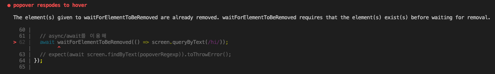

# Testing React with Jest and Testing Library
- Udemy의 리액트 테스트 강의 [Testing React with Jest and Testing Library](https://www.udemy.com/course/react-testing-library/)

<br>

## 1. Introduction
- React Testing Library vs Jest
  - React Testing Library
    - https://testing-library.com/docs/react-testing-library/intro
    - 테스트에 필요한 `Virtual DOM`을 제공한다. 이를 이용해서 컴포넌트를 Virtual DOM에 랜더링 할 수 있다.
    - Virtual DOM에 대한 `쿼리 기능`을 제공한다.(getByText... )
    - Virtual DOM과의 Interaction을 제공한다.
  - Jest
    - 테스트러너로 테스트를 찾고, 실행하며, 성공 여부를 확인한다.
    - 테스트 실패 여부는 테스트 함수 내부에서 Error가 throw 되는지 여부다. assertion도 실패하면 Error를 던지도록 되어있다.

<br>

- `npx creacte-react-app`
  - `npx`를 사용하면 cra를 로컬 머신에 설치하지 않고, 매번 최신 버전을 다운로드해서 사용한다.

<br>

- `setupTests.js` - `jest-dom`
  - cra로 프로젝트 생성시 setupTests.js가 생성되고 내부에 `@testing-library/jest-dom`를 import한다.
  - 이렇게하면 [jest-dom](https://github.com/testing-library/jest-dom)에서 제공하는 DOM-based Custom matchers들이 추가된다. 
  - 아래는 cra로 앱 생성시 기본 제공되는 App.js의 테스트 코드다.
  ```js
  // App.test.js
  test('renders learn react link', () => {
    //..

    // toBeInTheDocument은 jest-dom이 제공하는 matcher다.
    expect(linkElement).toBeInTheDocument();  
  });
  ```

<br>

- TDD - 아래의 순서로 진행한다.
  - 코드 작성 전 test spec 작성
  - 테스트 실패
  - 실패한 테스트를 기반으로 테스트가 통과할때까지 수단과 방법을 가리지 않고 코드를 작성
  - 테스트 통과

<br>

- Types of Tests
  - Unit tests : Test one unit of code in isoloation(예 - 단일 컴포넌트)
  - Integration tests : How multiple units work together(예 - 두개의 컴포넌트)
  - Functional tests : Tests a particular function of a software
    - 예 - 폼에 값을 채우고 submit button을 클릭한 후 원하는대로 동작하는지
    - [`The more your tests resemble the way your software is used, the more confidence they can give you.`](https://testing-library.com/docs/guiding-principles/)
    - Testing library가 추구하는 테스트
  - Acceptance/ E2E tests : 실제 브라우저와 서버를 이용한 테스트(Cypress, Selenium)

<br>

- Unit Testing vs Functional Testing
  - Unit Testing
    - `Isolation`: mock dependencies, test internals
    - 실패의 이유를 찾기 매우 쉽다.
    - 유저가 실제로 앱을 사용하는것과 괴리가 있다.
    - 리팩토링시 테스트가 깨지기 쉽다.
  - Functional Testing
    - Include all relavant units, test behavior
    - 실제 유저가 앱을 사용하는것과 비슷하다.
    - 리팩토링에 강하다.
    - 테스트 실패를 디버깅하기 힘들다.

<br>

- Accessibility and Finding Elements
  - Testing Library는 스크린 리더가 하는 방식으로 DOM쿼리하는걸 권장한다.(웹 접근성)
  - https://testing-library.com/docs/queries/about 
  - 예전에 Angular test공부할 땐 ***`data-testid`를 사용해서 DOM을 쿼리했는데, 이는 좋은 방법이 아니라고한다.***


<br>

<!-- https://github.com/bonnie/udemy-TESTING-LIBRARY -->

## 2. Simple App: Color Button
- `color-button`에 구현한다. 클릭시 색깔과 버튼명이 바뀌는 간단한 버튼.
- DOM 쿼리 후 assertion의 matcher는 가급적 jest-dom의 matcher를 사용한다.(DOM에서 텍스트를 꺼내서 `.toEqual()`을 호출하는게 아닌 DOM 자체에 `.toHaveTextContent()`를 검사하는 형식. 이게 훨씬 가독성 좋다)
- 가급적 컴포넌트의 `초기 상태` 테스트와 이후 `유저 인터렉션에 의한 상태 변화` 테스트는 분리하여 작성한다. **테스트가 너무 커지면 디버깅하기 힘들어진다.**
- `fireEvent.click`으로 클릭 이벤트 트리거 할 수 있다.

<br>

- `CSS moudle` import test
  - jest-dom의 `.toHaveStyle()`은 css module을 className에 할당하는 방식으로 작성된 코드는 테스트 할 수 없다.
  - jest에 의해서 css module의 import가 무시되기 때문이다.
  - 대부분의 경우 css가 기능에 영향을 끼치지 않기 때문에 기능 테스트에는 영향이 없다. 근데 `display:none`과 같이 기능에 영향을 끼칠 수 있는 스타일은 결국 테스트 환경에 추가되어야 한다.
  - jest가 className을 css로 해석할 수 있게 하기 위해서는 `Transformer`를 추가해야한다.([`jest-transform-css`](https://www.npmjs.com/package/jest-transform-css), [`jest-css-modules-transform`](https://www.npmjs.com/package/jest-css-modules-transform)). 사용법은 각각의 메뉴얼을 참고하자.
  - css모듈을 테스트하는 제일 쉬운 방법은 그냥 className으로 테스트하는 것이다.(`className={styles.hidden}` 이라면 `.toHaveClass('hidden')`으로 테스트 가능하다고 한다)

<br>

- `screen`의 accessible 관련 쿼리에서 optional을 작성하는것을 생활화 하자. 여러 요소가 있을 경우 특정 요소만 찝을 수 있도록 도와준다.
- `optional.name`은 role 등에 따라 쿼리하는 값이 달라진다.(button: 버튼명, checkbox: label의 text content, ...)

<br>

- 아래 `replaceCamelWithSpaces`와 같이 간단한 함수들은 functional test에 포함시켜도 좋다.(꼭 여러 케이스에 대응하는 unit test가 없어도 된다.)
```js
export function replaceCamelWithSpaces(colorName) {
  return colorName.replace(/\B([A-Z])\B/g, ' $1');  // 대문자를 찾으면 앞에 공백을 붙인다https://www.npmjs.com/package/eslint-plugin-testing-library
}
```
- 하지만 좀 복잡한 함수라면 functional test에서 실패에 대해 디버깅이 힘드니 꼭 unit test를 작성하자.
- functional test의 경우 `describe`함수를 이용해 **테스트를 그룹핑**하는게 좋다.

<br>

## 3. ESLint, Prettier
- 각각에 대한 기본설명은 생략

### 3.1. ESLint

- [`jest-dom`](https://www.npmjs.com/package/eslint-plugin-jest-dom), [`testing-library`](https://www.npmjs.com/package/eslint-plugin-testing-library)은 eslint plugin을 제공한다. 이를 적용해서 각각의 라이브러리에 대한 린팅 규칙을 추가할 수 있고, 플러그인이 config를 상속할 수도 있다.
- 플러그인 적용 순서는 아래와 같다.
  1. 플러그인 설치
  ```
  npm i eslint-plugin-testing-library eslint-plugin-jest-dom --save-dev
  ```
  2. package.json의 `eslintConfig` 설정부 제거
  3. .eslintrc.json 생성 및 작성
  ```json
  {
    "plugins": [
      "testing-library",
      "jest-dom"
    ],
    "extends": [
      "react-app",
      "react-app-jest",
      "plugin:testing-library/react",
      "plugin:jest-dom/recommended"
    ]
  }
  ```
- `VSCode ESLint 플러그인`도 사용한다. 관련 설정은 에디터 단위로 설정할 수 있고, 프로젝트 단위로도 설정 가능. 프로젝트단위로 설정하려면 프로젝트 루트에 `.vscode/setting.json`를 만들고 설정을 작성한다. 예전에는 아래와 같은 설정이 필요했다.
```json
{
  "eslint.options": {
    "configFile": ".eslintrc.json"
  },
  "eslint.validate": ["javascript", "javascriptreaact"],
  "editor.condeActionsOnSave": {
    "source.fixAll.eslint": true
  },
}
```
- 플러그인의 2.0.4버전 이후 지금은 딱 이것만 추가하면 된다. 딴거 넣으면 오히려 에러발생할 수 있다.
```json
"editor.codeActionsOnSave":
 {
  "source.fixAll.eslint": true
 }
```
- gitignore에 아래 내용을 추가한다.
```
.vscode
.eslintcache
```

<br>

### 3.2. Prettier
- `.vscode/settings.json`에 아래와 같은 내용을 추가한다.
```json
{
  // ...
  "editor.defaultFormatter": "esbenp.prettier-vscode",
  "editor.formatOnSave": true
}
```
- 이렇게 하면 아마 기본 룰로 작동하는듯 하다. `"prettier.configPath": ".prettierrc",`을 추가하면 별도 설정으로 포맷팅한다.

<br>

## 4. Sundaes on Demand: Form Review and Popover
- Sundaes on Demand는 아이스크림 주문 앱이다. 이를 TDD로 구현한다.
- 주문의 Entry, Summary, Confirm 3개 페이지로 구성된다. 여기에 폼과 popover 요소가 들어가고 이는 bootstrap-react로 구현한다. 구현하기 전 bootstrap이 어떻게 해당 내용을 구현하는지 파악하고 이에 맞는 테스트 코드를 작성한다.
- 서버의 동작은 [`mock-service-worker`](https://mswjs.io/)를 이용해서 목킹한다.

<br>

### 4.1 Popover test
- 서비스 약관에 마우스 hover시 팝오버가 나오는 내용을 테스트한다. react-bootstrap의 구현을 살펴보면 팝오버 요소가 DOM에 나타났다가 사라진다. 이에 맞춰서 테스트를 작성한다.
- [`fireEvent`](https://testing-library.com/docs/dom-testing-library/api-events)는 click과 같은 hover 이벤트 메서드를 제공하지 않는다. testing-library는 사용자의 이벤트를 발생시킬 수 있는 [`user-event`](https://testing-library.com/docs/user-event/intro/) 패키지를 제공하는데, 여기 있는 이벤트는 가급적 여기 있는걸 이용하자. 없다면 이벤트 객체를 만들고 fireEvenet 메서드를 사용해야한다.
  > `@testing-library/user-event`는 이제 cra에서 기본으로 넣어주는듯하다. 그냥 들어있다.

  > cra의 dependencies에 테스팅 관련 패키지가 들어있는데, cra에서는 굳이 dependencies - devDependencies를 구분하지 않는다고 한다.

- popover 테스트시, 생기는건 동기인데, 사라지는건 비동기이다!. 동기로 동작하는 assertion을 그냥 수행하면 에러가 발생한다.[`waitForElementToBeRemoved`](https://testing-library.com/docs/dom-testing-library/api-async/#waitforelementtoberemoved)메서드를 이용해 처리한다.
```js
// SummaryForm.test.jsx

test("popover respodes to hover", async () => {
  // ...

// 3. unhover checkbox label : popover disappears
  userEvent.unhover(termsAndConditions);

  // popover가 비동기로 사라진다. -> 테스트는 이미 끝났다 -> testing library가 화를 낸다. 
  const nullPopoverAgain = screen.queryByText(popoverRegexp);
  expect(screen.queryByText(popoverRegexp)).not.toBeInTheDocument();

  // async/await와 waitForElementToBeRemoved메서드를 이용해 비동기로 사라지는게 완료된 후 쿼리한다.
  await waitForElementToBeRemoved(() => screen.queryByText(popoverRegexp));
})
```
- `waitForElementToBeRemoved` 메서드는 첫째 인자로 요소/요소반환 함수를 받는다. 이 요소가 함수 실행 시점에 존재하다가 비동기로 사라지면 통과한다. 만약 애초에 존재하지 않거나 동기로 사라지는 요소를 여기에 넣으면 아래와 같은 에러를 보게 된다.



- 뭔가 비동기로 appear/disapper 하는 요소에 대한 테스트는 [여기](https://testing-library.com/docs/guide-disappearance)를 참고하자. 

  > 🍎 🍎 참고로 리액트에서는 [랜더링이나 이벤트 발생 코드를 act()로 래핑하도록 권장](https://ko.reactjs.org/docs/test-utils.html#act)하는데, `testing-library` 사용시 랜더링, 이벤트 발생 코드가 내부적으로 [자동으로 act()에 래핑된다](https://testing-library.com/docs/preact-testing-library/api/#act)고 한다. (테스트에서 랜더링시 testing-library의 `render`를 쓰고, `screen`을 이용해 쿼리하고 이벤트는 `fireEvent`, `userEvent`를 이용하기 때문에 가능한 일. 랜더로 예를들면 리액트의 네이티브 메서드인 `ReactDOM.render`를 사용할 경우 상태업데이트, 리랜더링 같은 동작들은 테스트에 반영되기 전에 테스트가 먼저 실행될것이다.)

  > act와 관련하여 [`secrets of the act(...) api`](https://github.com/threepointone/react-act-examples/blob/master/sync.md)를 참고하자. 리액트의 동작에 대해 좀 더 이해할 수 있게 된다.

### 4.2 [screen Query Method](https://testing-library.com/docs/react-testing-library/cheatsheet#queries)
> `command`[`All`]By`QueryType`
- command
  - `get` : DOM에 element가 있다고 가정한다.
  - `query`: DOM에 elment가 없다고 가정한다.
  - `find` : DOM에 element가 비동기로 생긴다고 가정한다. 
- All : 붙일경우 여러개, 생략할 경우 1개만 있다고 가정한다.
- QueryType
  - `Role`, `AltText`, `Text`, `PlaceholderText`, ...

- Query method를 잘 선택해서 구성해야 하는 이유는 예를들어 없는 요소를 `getByRole`메서드로 쿼리하면 에러를 던져 테스트가 실패하기 때문이다. 없을거란걸 안다면 `queryByRole`을 해야한다.

<br>

## 5. Simulating Server Response with Mock Service Worker
Sundae Demand의 OrderEntry 컴포넌트를 테스트한다. 이 컴포넌트는 서버로부터 `scoops`, `toppings` 데이터를 받아 주문을 구성할 수 있는 options를 랜더링하고, 사용자가 체크한 값에 맞춰 total price를 계산해준다.

### 5.1 Tests
테스트는 아래의 내용으로 구성된다.
- 옵션 이미지 랜더링 테스트
- Mock Service Worker
- Mock server response - scoops, toppings

### 5.2 [Mock Service Worker](https://mswjs.io/)
- 사용 목적
  - network call 인터셉트
  - 응답 정의(mock)
- 설치
```
npm install msw --save-dev
```
- [Create handler](https://mswjs.io/docs/getting-started/mocks/rest-api)
- [Create test server](https://mswjs.io/docs/getting-started/integrate/node)
  - jest를 이용한 테스트시 런타임은 node
  
- Make sure test server listens during all tests
  - reset after each test
  
