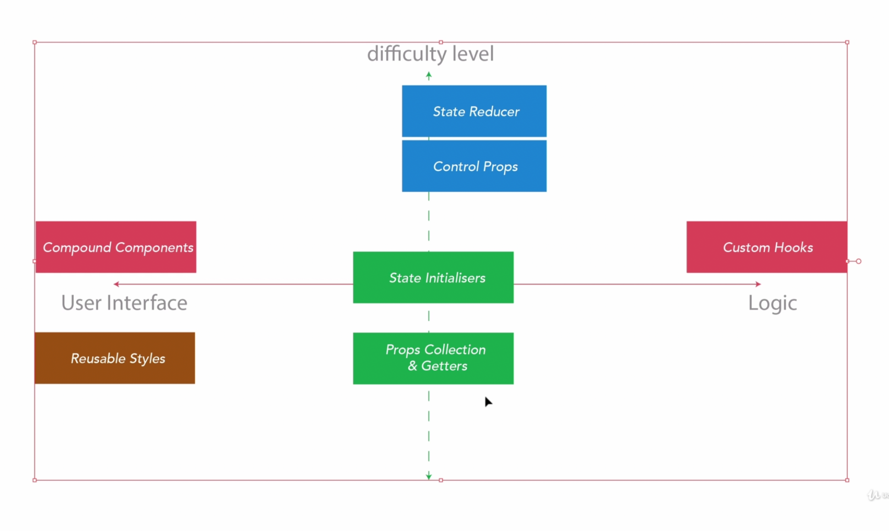

# The Complete Guide to Advanced React Component Patterns

> Udemy의 리액트 컴포넌트 디자인 패턴 강의 [The Complete Guide to Advanced React Component Patterns](https://www.udemy.com/course/the-complete-guide-to-advanced-react-patterns/)

## 목차
  - 컴포넌트 기본 구성은 생략
  - ### [Custom Hook Animation](#19-23-custom-hook-animation)
  - ### [Compound Component Pattern](24-30-compound-component-pattern)
  - ### [Patterns for Crafting Reusable Patterns](#31-33-patterns-for-crafting-reusable-patterns)
  - ### [Control Props Pattern](#34-37-control-props-pattern)
  - ### [Custom Hooks: A Deeper Look at the Foundational Patterns](38---42-custom-hooks-a-deeper-look-at-the-foundational-patterns)
  - ### [The Props Collection Pattern](#43---46-the-props-collection-pattern)
  - ### [The Props Getters Pattern](#47---49-the-props-getters-pattern)
  - ### [The State Initializer Pattern](#50-54-the-state-initializer-pattern)
  - ### [The State Reducer Pattern](#55---58-the-state-reducer-pattern)
  - ### [Classifying the Patterns: How to choose the best API](#59---60-Classifying-the-Patterns:-How-to-choose-the-best-API)

### 9. Building and styling the medium clap
- `MediumClap` 컴포넌트는 3개의 자식 컴포넌트를 가지는 Container Component인 버튼이다. 
- 기본적으로 버튼은 박수모양 SVG 아이콘 `ClapIcon`과 클릭시 내가 몇 번 박수쳤는지 나타내는 `ClapCount`, 그리고 게시글의 총 박수 횟수를 나타내는 `CountTotal`로 구성된다. 자식은 `Stateless Component`다.
```js
const MediumClap = () => {
  return (
    <button>
      <ClapIcon />
      <ClapCount />
      <CountTotal />
    </button>
  )
}
```
- 자식 컴포넌트들은 한번에 보여지는게 아닌 클릭과 함께 변하는 `부모 컴포넌트의 상태`에 따라 보여진다.
- 앵귤러와 같은 방식의 컴포넌트의 `encapsulated style`을 구현하는 법을 몰랐는데 아래와 같은 방식으로 한다.
```css
/* index.css */
.clap {
  position: relative;
  outline: 1px solid transparent;
  border-radius: 50%;
...
```
```js
import React from 'react';
import styles from './index.css'

const MediumClap = () => {
  return (
    <button className={styles.clap}>
      <div className={styles.clap}></div>
      <ClapIcon />
      <ClapCount />
      <CountTotal />
    </button>
  )
}
```
- 이렇게 하면 css에서 `.clap`에 구현한 스타일을 `className={styles.clap}`을 지정한 요소에 추가할 수 있는데, 고유한 해시값이 할당된다.(컴포넌트 내에서 해시값은 같다)
```HTML
<button class="_1rhF2AtahLt0Armnpt0Dp1">
  <div class="_1rhF2AtahLt0Armnpt0Dp1">...</div>
</button>
```
- `._1rhF2AtahLt0Armnpt0Dp1` 셀렉터에 style.css에서 작성한 스타일이 적용된다. 이게 별도 설정 없이 동작하는것인지 다른 앱에서 테스트 해봐야 알 것 같다.

<br>

### 10. Handling User Interactivity
- `MediumClap`의 상태값은 `count`, `totalCount`, `isClicked`로 세가지다.(isClicked는 count로 추론 가능한데 굳이 추가해야 하는지 의문)
- `useState` 훅으로 상태를 만들고 자식 컴포넌트 props로 전달한다.
```js
const initialState = {
  count: 0,
  countTotal: 267,
  isClicked: false
}
const MediumClap = () => {
  const MAXIMIUM_USER_CLAP = 50;
  const [clapState, setClapState] = useState(initialState);
  const { count, isClicked, countTotal} = clapState;
  const handleClapClick = () => {
    setClapState(prev => ({
      isClicked: true,
      count: Math.min(count + 1, MAXIMIUM_USER_CLAP), 
      countTotal: count < MAXIMIUM_USER_CLAP ? prev.countTotal + 1 : prev.countTotal
    }))
  }
  return (
    <button className={styles.clap} onClick={handleClapClick}>
      <ClapIcon isClicked={isClicked}/>
      <ClapCount count={count}  />
      <CountTotal countTotal={countTotal} />
    </button>
  )
}
```
- `ClapIcon`은 클릭되는 순간 초록색으로 채워진다. css의 `.icon.checked`에 구현되어있는데, `isClicked` props에 따라 아래와 같이 스타일을 넣을 수 있다.
```js
const ClapIcon = ({ isClicked }) => {
  return <span>
    <svg 
      className={`${styles.icon} ${isClicked && styles.checked}`}
      //...
```

<br>

### 11. High Order Components recap
- [HOC(High Order Component, 고차 컴포넌트)](https://ko.reactjs.org/docs/higher-order-components.html)는 Component를 인자로 받아 일부 레이어(공통로직 등)가 추가된 Component*를 반환하는 `함수`다. 인자로 전달되는 컴포넌트를 보통 `WrappedComponent`라고 부른다.
- 우리의 `MediumClap`컴포넌트에 에니메이션(레이어)를 추가하는 HOC `withClapAnimation`를 아래와 같이 작성한다.
```js
const withClapAnimation = WrappedComponent => {
  class WithClapAnimation extends Component {
    // this handles animation logic
    
    animate = () => { /* 에니메이션 로직 */ }
    render() {
      return <WrappedComponent {...this.props} animate={this.animate} />
    }
  }
  return WithClapAnimation;
}


const Usage = () => {
  const AnimatedMediumClap = withClapAnimation(MediumClap);
  return <AnimatedMediumClap />
}

export default Usage;
```
- `export default MediumClap withClapAnimation(MediumClap);`라고 구현하지 않고 Usage 함수를 만든 이유는 잘 모르겠다. 강의에서 컴포넌트의 재사용성을 언급했는데 지금은 봐도 어디서 재사용정이 생기는건지 모르겠음.

<br>

### 12 - 17. Animation(HOC)
> 재미있어서 정리한다. 이 강좌의 목적은 animation은 아니다.

- `MediumClap`의 애니메이션은 [`mojs`](https://mojs.github.io/) 라이브러리를 이용한다.
- `mojs`는 시간의 경과에 따른 상태 변화를 나타내는 `Timeline`객체를 만들고, `replay` 메서드를 이용해 t=0 ~ t=end 까지의 에니메이션을 재생시킬 수 있다.
- Timeline에는 mojs의 여러 객체들을 추가할 수 있다. 이 객체는 타임라인 실행간 각 요소별 타임라인을 의미한다. HTML요소에 대해 타임라인을 만들기 위해서는 해당 DOM 요소를 쿼리해야하는데, 따라서 컴포넌트 랜더링 이후에 만들어 져야 하므로 `componentDidMount` 훅에 만들어야한다.
- HTML요소에 대한 타임라인은 `new mojs.HTML()`로 만들 수 있다. mojs가 직접 요소를 만들어 주기도 하는데, 예를들어 MediumClap 클릭시 흩뿌려지는 삼각형, 원 등의 도형이 있다. 이를 `Burst`라고 하고 이에 대한 타임라인은 `new mojs.Burst()`로 만든다.
- HTML 요소에 대한 타임라인을 만들 때, HTML에 에니메이션을 발생시켜 한번 초기화 해줘야 한다. 그러지 않으면 요소는 t=0일때의 상태로 초기화 된다.(t=end 상태가 되어야 함) 아래는 transform을 발생시켜 #clap의 Timeline을 초기화한다.
  ```js
    const clap = document.getElementById('clap');
    clap.style.transform = 'scale(1,1)';
  ```
- Timeline객체는 `then` 메서드로 여러 타임라인을 계속에서 체이닝 할 수 있다.
- 기타 API는 [mojs-API](https://mojs.github.io/api/) 문서를 참고하자. 튜토리얼도 있다. 자세한 구현 코드 정리는 생략.

<br>

### 19-23 Custom Hook Animation
- 소스코드 : patterns/02.js
- 앞서 HOC로 MediumClap 컴포넌트의 props에 animationTimeline을 전달했는데, Custom Hook으로도 구현 가능하다. 
```js
const useClapAnimation = () => {
  const [animationTimeline, setAnimationTimeline] = useState(() => new mojs.Timeline())
  useEffect(() => {
    const tlDuration = 300;
    const scaleButton = new mojs.Html({
      el: '#clap', 
      duration: tlDuration,
      scale: { 1.3: 1 }, 
      easing: mojs.easing.ease.out,
    });
    // ...

    const newAnimationTimeline = animationTimeline.add([
      scaleButton, 
      // ...
    ]);
    setAnimationTimeline(newAnimationTimeline);
  }, []);

  return animationTimeline;
}
```
- 클래스 컴포넌트의 `componentDidMount` 훅은 `useEffect`훅에 대응되고, `state`는 `useState`에 대응된다.

- 이런 방식은 사실 문제가 있다. id로 참조하는것은 컴포넌트가 전역에서 참조 가능하기 때문에 캡슐화가 되지 않았다. 
- `컴포넌트의 캡슐화`를 위해 [Callback Ref](https://ko.reactjs.org/docs/refs-and-the-dom.html#callback-refs)를 사용한다. ref에 setState 함수를 호출하는 setRef함수를 넣는 방식인데, `useCallback`을 지정하지 않으면 setRef호출시 상태 변경으로 인해 컴포넌트가 리랜더링 되면서 maximum call stack 오류가 발생한다.
```js
const MediumClap = () => {
  // ...
  
  const [ {clapRef, clapCountRef, clapTotalRef}, setRefState ] = useState({});
  const setRef = useCallback((node) => {
    setRefState(prevRefState => ({
      ...prevRefState,
      [node.dataset.refkey]: node
    }))
  }, []);

  // ...
  return (
    <button ref={setRef} data-refkey="clapRef" className={styles.clap} onClick={handleClapClick}>
      ...
    </button>
  ) 
}
```
- 총 3개의 ref( `clap`, `clapCount`, `clapCountTotal` )가 필요한데, `animationTimeline`을 한번에 세 개 모두 생성하므로, 모두 참조가 생겼을 때 `useEffect`훅이 실행되어야한다. 따라서 useEffect훅 시작부에 조건문을 걸고 deps를 추가해줘야 한다. 아래와 같이 하면 된다.
```js
const useClapAnimation = ({ clapEl, clapCountEl, clapTotalEl }) => {

  // ...
  useEffect(() => {
    if(!clapEl || !clapCountEl || !clapTotalEl) return;
    
    // animation timeline 생성로직
  }, [clapEl, clapCountEl, clapTotalEl]);
}
```
- `deps`를 빼먹으면 ref들이 평생 undefined만 참조하니 주의하고, 위 조건문을 useClapAnimation 훅의 최 상단에 위치시면 `useState`/`useEffect` 초반엔 실행되지 않아, ***훅의 실행 순서가 꼬여 앱이 터진다***. 근데 이를 아주 상세히 에러메시지로 알려주는 리액트는 너무 똑똑하다!
- 추가적으로 커스텀 훅의 `useEffect`훅을 `useLayoutEffect` 훅으로 바꿔 최적화가 가능하다. [❗️useEffect vs useLayoutEffect 🥨](https://blog.logrocket.com/useeffect-vs-uselayouteffect-examples/ )를 참고하자.

<br><br>

### 24-30 Compound Component Pattern
- 03.js에 구현한다.
- Compound Component Pattern`은 자식 컴포넌트를 부모컴포넌트 바깥으로 노출(public API)시키는 패턴이다. 이 패턴은 아래와 같은 장점이 있다.
  1. 노출된 자식 컴포넌트는 바깥에서 커스터마이징 하기 쉬워진다.
  2. 자식 컴포넌트가 노출되며 사용자가 API 구조를 이해하기 쉬워진다.
  3. 컴포넌트의 자식 컴포넌트 각각에 `props`를 전달하기 훨씬 편해진다. (`Props Overload`)
    - 만약 자식컴포넌트가 공개되지 않으면? 아래와 같이 다소 직관적이지 못한 방식으로 props를 전달해야한다.
      ```js
      <MediumClap 
        clapProps={...} 
        clapCountProps={...} 
        clapTotalProps={...}
      />
      ```
- 부모 컴포넌트는의 역할은 기본적으로 자식 컴포넌트들의 동작을 총괄하는데, 이 때 `ContextAPI`를 사용한다.(props는 이 컴포넌트를 쓰는 사람이 전달할 것)
- 자식컴포넌트의 공개와 컴포넌트 사용은 아래와 같은 방식으로 한다.
```js
// ...

MediumClap.Icon = ClapIcon;
MediumClap.Count = ClapCount;
MediumClap.Total = CountTotal;

const Usage = () => {
  return(
    <MediumClap>
      <MediumClap.Icon />
      <MediumClap.Count />
      <MediumClap.Total />
    </MediumClap>
  )
}
```
- 자식 컴포넌트 공개 외에 컴포넌트의 상태값도 공개 가능해야한다. callback을 이용한다.
```js
const MediumClap = ({ onClap, children }) => {
  // ...

  const componentDidMount = useRef(true);
  useEffect(()=> {
    if(!componentDidMount.current) {
      onClap && onClap(clapState);
    }
    componentDidMount.current = false;
  }, [count])
  
  //...
}


const Usage = () => {
  const [count, setCount] = useState(0);

  const handleClap = (clapState) => {
    setCount(clapState.count);
  }
  return(
    <div style={{width: '100%'}}>
      <MediumClap onClap={handleClap}>
        <MediumClap.Icon />
        <MediumClap.Count />
        <MediumClap.Total />
      </MediumClap>
      {!!count && <div>{`You have clapped ${count} times`}</div>}
    </div>
  )
}
```
- useRef를 이용해서 `componentDidMount`를 구현하면 컴포넌트가 마운트 된 후 기본으로 onClap이 호출되는것을 막을 수 있다.
- 예제에서는 자식 컴포넌트의 props를 사용하진 않았지만 얼마든지 사용 가능함을 알 수 있다.

<br><br>

### 31-33 Patterns for Crafting Reusable Patterns
- 04.js에 구현한다.
- Compound Component 패턴에서 컴포넌트의 각 자식을 공개해서 props를 사용하기 쉽게 만들었다. 스타일 커스터마이징은 이 때 빛을 발한다.
- `style`, `className`같은 props를 자식에게 바로 주입하고 자식은 이를 받아 컴포넌트에 적용하는 간단한 형태다.

1. `style props`를 받아 사용할 수 있도록 구현한 예다.
```js
const MediumClap = ({ onClap, children, style: userStyles = {}}) => {
  // ...
  return (
    <Provider value={memoizedValue}>
      <button 
        style={userStyles}
      />
    </Provider>
  )
}
const ClapCount = ({style: userStyles = {}}) => {
  // ...
  return <span 
    style={userStyles}
  >
    {countTotal}
  </span>
}
const Usage = () => {
  const [count, setCount] = useState(0);

  const handleClap = (clapState) => {
    setCount(clapState.count);
  }
  return(
    <div style={{ width: '100%' }}>
      <MediumClap onClap={handleClap} style={{ border: '1px solid blue', background: '#fefefe' }}>
        <MediumClap.Icon />
        <MediumClap.Count style={{ background: '#8cacea' }} />
        <MediumClap.Total style={{ background: '#8cacea' }}/>
      </MediumClap>
      {!!count && (
        <div className={styles.info}>{`You have clapped ${count} times`}</div>
      )}
    </div>
  )
}
```
2. `className props`를 받아 사용할 수 있도록 구현한 예다. class selector에 대한 스타일을 정의한 stylesheet 를 작성하고 이를 import한 뒤 컴포넌트의 `className props`에 styles.className을 주입하면 스타일이 적용된다.
```js
// ...
import userCustomStyles from './usage.css'

// ...
const MediumClap = ({ onClap, children, style: userStyles = {}, className }) => {
  // ...
  const classNames = [styles.clap, className].join(' ').trim();
  return (
    <Provider value={memoizedValue}>
      <button 
        className={classNames} 
      />
      </Provider>
  )
}
const Usage = () => {
  const [count, setCount] = useState(0);

  const handleClap = (clapState) => {
    setCount(clapState.count);
  }
  return(
    <div style={{ width: '100%' }}>
      <MediumClap onClap={handleClap} className={userCustomStyles.icon}>
        <MediumClap.Icon className={userCustomStyles.icon} />
        <MediumClap.Count className={userCustomStyles.count} />
        <MediumClap.Total className={userCustomStyles.total} />
      </MediumClap>
      {!!count && (
        <div className={styles.info}>{`You have clapped ${count} times`}</div>
      )}
    </div>
  )
}
// ...
```

<br><br>

### 34-37 Control Props Pattern
- `05.js`에 구현한다.

- HTML의 Form Element( ex - input)는 이 자체가 상태값을 가지는 엘리먼트로, 리액트에서 이 상태값을 조작하기 위해 두가지 방법이 있다. 두가지 방법이 있다.
  1. [Controlled Component(제어 컴포넌트)](https://ko.reactjs.org/docs/forms.html#controlled-components)
    - 리액트 상태를 input의 value에 연결하고, change 이벤트 핸들러를 등록해 상태를 변경하는 방식.

  2. [Uncontrolled Component(비제어 컴포넌트)](https://ko.reactjs.org/docs/uncontrolled-components.html)
    - 엘리먼트의 `ref` 속성을 이용하는 방식

- Controlled Props 패턴은 제어 컴포넌트의 방식과 같은 방식으로 컴포넌트 상태를 제어하는것을 말한다. `values`, `onChange` props로 컴포넌트의 상태를 제어한다. value는 상태값 주입, onChange는 상태변화를 캐치하는 콜백이다.
- 단, `values`, `onChange` 두개를 다 전달하지 않을 경우에는 ***컴포넌트에 상태값이 존재해야 한다.*** 이를 판단하기 위해 컴포넌트 함수 내에 `isControlled`라는 변수를 선언하고 이에 따라 다르게 동작하게 설계한다. 
```js
/**
 * 컴포넌트
 */

const MediumClap = ({ 
  onClap, 
  children, 
  style: userStyles = {}, 
  className,
  values = null
}) => {

  // ...
  

  // 외부 상태와 상태변경 콜백 모두 넘어오면 Controlled Component로 여긴다.
  const isControlled = !!values && !!onClap;
  // ...  
  const handleClapClick = () => { 
  animationTimeline.replay();
  // Controlled Component라면 컴포넌트 상태를 변경하지 않는다 -> 이렇게 함으로써 MAXIMIUM_CLAP_VAL 등을 외부에서 다시 정의하고 상태 변경 로직을 외부에서 override 할 수 있게 된다.
  isControlled 
    ? onClap() 
    : setClapState(prev => ({
        // ...
      }));
  }
  useEffect(()=> {
    if(!componentDidMount.current && !isControlled) {
      // 컴포넌트 내부 상태(clapState) 콜백으로 내보내는건 Controlled Component가 아닐때에만
      onClap && onClap(clapState);
    }
    componentDidMount.current = false;
  }, [clapState, onClap, isControlled]);

  // ...

```
```js
/**
 * Usage
 */
const INITIAL_STATE = {
  count: 0,
  countTotal: 2100,
  isClicked: false
}
// 컴포넌트 내에 50개로 정의했는데, 이는 onClap 로직상에 구현된다. handleClap에서 상태를 변경하는 부분을 사용자가 정의하므로 이런 조건들을 밖에서 커스터마이징 할 수 있게 되었다.
const MAXIMIUM_CLAP_VAL = 10;
const Usage = () => {
  const [state, setState] = useState(INITIAL_STATE);

  const handleClap = useCallback(() => {
    setState(({count, countTotal})=> ({
      count: Math.min(count + 1, MAXIMIUM_CLAP_VAL),
      countTotal: count < MAXIMIUM_CLAP_VAL ? countTotal + 1 : countTotal,
      isClicked: true
    }));
  }, [setState]);

  return(
    <div style={{ width: '100%' }}>
      <MediumClap values={state} onClap={handleClap} className={userCustomStyles.icon}>
        <MediumClap.Icon className={userCustomStyles.icon} />
        <MediumClap.Count className={userCustomStyles.count} />
        <MediumClap.Total className={userCustomStyles.total} />
      </MediumClap>
      <MediumClap values={state} onClap={handleClap} className={userCustomStyles.icon}>
        <MediumClap.Icon className={userCustomStyles.icon} />
        <MediumClap.Count className={userCustomStyles.count} />
        <MediumClap.Total className={userCustomStyles.total} />
      </MediumClap>
      {!!state.count && (
        <div className={styles.info}>{`You have clapped ${state.count} times`}</div>
      )}
    </div>
  )
}
```
- 이렇게 하면 `MediumClap` 버튼이 여러개일 때에도 모두 동일한 상태를 공유할 수 있게 된다. 또 장점으로 maximum value 같은 값들을 MediumClap 컴포넌트 밖에서 제어할 수 있게 되었다는 점이다.

> 🍏🍎🍐🍊 `isControlled`에 따라서 클릭시 `onClap`을 호출할지 `setClapState`를 호출할 지 분기처리하는 부분이 처음엔 잘 이해가 안됐다. 잘 생각해보면 이렇게 분기처리 함으로써 상태변경 로직을 컴포넌트 사용자가 완전히 재정의 할 수 있게 된다. ***물론, isController 여부에 관계 없이 클릭시 `내부 상태변경 -> onClap콜백에 전달 -> onClap에서 내부 상태변경 로직 무시하고 그냥 상태변경 로직 정의` 방식으로 작성되어도 오류없이 동작하게 할 수는 있다.***


<br><br>

### 38 - 42 Custom Hooks: A Deeper Look at the Foundational Patterns
- `02.js`(CustomeHook)을 리팩토링하여 `06.js`를 작성한다.
- 기존에 MediumClap의 복잡한 Animation Logic을 `useClapAnimation` 훅으로 분리했는데, 나머지 로직들도 커스텀 훅으로 분리한다. `useDOMRef`, `useClapState`, `useEffectAfterMount` 이다.
- 커스텀훅을 사용하면 가독성도 좋아지지만 훅 자체를 사용자에게 제공해서 재사용하게 할 수 있다. 여기서 구현한 훅들 대부분이 재사용 가능하고, `useClapAnimation` 훅 역시 `useAnimation`이란 훅으로 만들어 ***좀 더 범용성 있게 만들 어 앱 전체의 애니메이션 로직을 훅 하나로 해결 가능하다.***

1. `useDOMRef` 
- MediumClap컴포넌트에 요소에 `data-refkey` 어트리뷰트 값을 가지는 element의 DOM Reference를 저장하는 로직이 있다. 이를 분리할 수 있다. 이를 훅으로 분리한다.
```js
const useDOMRef = () => {
  const [DOMRef, setRefState ] = useState({});

    const setRef = useCallback((node) => {
    setRefState(prevRefState => ({
      ...prevRefState,
      [node.dataset.refkey]: node
    }))
  }, [])
  return [DOMRef, setRef];
}

const MediumClap = () => {
  const [{clapRef, clapCountRef, clapTotalRef}, setRef] = useDOMRef();
  // ...

}
```
- `data-refkey`만 적용된 Element가 있다면 어디서든 사용 가능한 훅이다.

2. `useClapState` 
- MediumClap 컴포넌트에만 사용 가능하다고 볼 수 있다. `setState로직에 제약조건`이 있는데 이를 묶을 수 있다는 장점이 있다.
```js
const useClapState = (initialState) => {
  const MAXIMIUM_USER_CLAP = 50;
  const [clapState, setClapState] = useState(initialState);
  const updateClapState = useCallback(() => {
    setClapState(({count, countTotal}) => ({
      isClicked: true,
      count: Math.min(count + 1, MAXIMIUM_USER_CLAP), 
      countTotal: 
        count < MAXIMIUM_USER_CLAP 
          ? countTotal + 1 
          : countTotal
    }))
  }, [])
  return [clapState, updateClapState];
}

const MediumClap = () => {
  const [clapState, updateClapState] = useClapState(INITIAL_STATE);
  const { count, isClicked, countTotal } = clapState;
  // ...

}
```

3. `useEffectAfterMount`
- `02.js`에서는 안나오고 `04.js`에서 콜백 함수를 props로 받을 때 DOM이 랜더링 된 후에 클릭시에만 콜백이 호출되도록 하기 위한 로직을 훅으로 만든다. 
- 분리하려는 로직은 `useEffect`훅에 `콜백`, `deps`를 가진다.
```js
const useEffectAfterMount = (cb, deps) => {
  const componentDidMount = useRef(true);
  useEffect(()=> {
    if(!componentDidMount.current) {
      return  cb();
    }
    componentDidMount.current = false;
    // lint 꺼줘야함
  }, deps)
}

const MediumClap = () => {
  // ...

  useEffectAfterMount(() => {
    animationTimeline.replay();
  }, [animationTimeline, clapState]);

  // ...
}
```
- deps를 인자로 받는데, 동적이기 때문에 eslint에서 경고를 보낸다. 주석을 추가해 끄면 된다.
- 콜백이 값을 반환할 수도 있기때문에 `return cb()`와 같은 형태로 호출한다.


<br><br>

### 43 - 46 The Props Collection Pattern
- 06.js -> `07.js`에 구현한다.
- 이전에는 MediumClap 컴포넌트를 정의하고, 여기에 기본 로직을 다 담았었다.(animation, state, ...) 이를 ClapContainer 분리하고, Container는 `props`로 기본 로직을 받는다.
```js
const ClapContainer = ({children, setRef, onClick, ...restProps }) => {
  return <button 
    ref={setRef} 
    className={styles.clap} 
    onClick={onClick}
    {...restProps}
  >
    {children}
  </button>
}

const Usage = () => {
  const [clapState, updateClapState] = useClapState(INITIAL_STATE);

  // ...
    return (
    <ClapContainer 
      setRef={setRef} 
      data-refkey="clapRef" 
      onClick={updateClapState}
    >
      <ClapIcon isClicked={isClicked}/>
      <ClapCount setRef={setRef} data-refkey="clapCountRef" count={count} />
      <CountTotal setRef={setRef} countTotal={countTotal} data-refkey="clapTotalRef"/>
    </ClapContainer>
  )
}
```
- 위의 리팩토링에서 `ClapContainer` 를 비롯한 컴포넌트들에 `...restProps` 를 작성했다. 이건 어떻게보면 비 필수 props를 정의하는거라고 볼 수 있다. `data-refkey`도 여기로 들어가게 된다. 
- 이 때, 기본 로직들은 다 Custom Hook으로 구현했었는데, 그러면 컴포넌트 사용자는 ***매 사용마다 커스텀훅을 다 불러와서 Container/UI 컴포넌트에 props로 전달하는 코드를 작성해야한다.*** 로직이 복잡해지면 사용하기 어려워진다.
- 이를 편리하게 하는 패턴이 `Props Collection Pattern`이다. 기본 제공하는 props들을 collection형태로 제공해서, collection만 불러다가 props로 전달해주면 된다. 
- 예를들어 `clapState`와 관련되서 각각의 컴포넌트들의 사용하는 값들이 다르다. 컴포넌트 사용자가 이를 다 판단해서 분리작성하는건 너무 힘들다! 이를 ***`컬렉션`으로 분리하고 각 컴포넌트에 주입***한다. 컬렉션이란 여러개 값의 집합이므로, 의도적으로 몇 개 더 넣어본다. 아래와 같이 `useClapState`훅을 리팩토링 해보자.
```js
const useClapState = (initialState) => {
  // 기존 훅 코드 ... 

  // toggler(클릭하는 녀석 = 컨테이너)의 props colletion
  const togglerProps = {
    onClick: updateClapState,
    'aria-pressed': clapState.isClicked
  };

  // couter의 props colletion
  const counterProps = {
    count: clapState.count,
    'aria-valuemax': MAXIMIUM_USER_CLAP,
    'aria-valuemin': 0,
    'aria-valuenow': clapState.count,
  };
  return {clapState, updateClapState, togglerProps, counterProps};
}
```
- toggler 컴포넌트와 counter 컴포넌트의 `props collection`을 분리하였다. 아래와 같이 사용하면 된다.
```js

const Usage = () => {
  const {clapState, updateClapState, togglerProps, counterProps} = useClapState(INITIAL_STATE);

  // ...

  return (
    <ClapContainer 
      setRef={setRef} 
      data-refkey="clapRef" 
      {...togglerProps}
    >
      <ClapIcon isClicked={isClicked}/>
      <ClapCount setRef={setRef} data-refkey="clapCountRef" {...counterProps} />
      <CountTotal setRef={setRef} countTotal={countTotal} data-refkey="clapTotalRef"/>
    </ClapContainer>
  )
}
```
- `ClapContainer`, `ClapCount`에 props collection을 전달했고, `...restProps`에 의해서 각 컴포넌트 내부에 잘 펼쳐져 전달될 것이다. ***사용자는 `useClapState`훅의 데이터를 하나하나 살펴보고 어떤 컴포넌트에 어떤 속성을 넣을지 고민하지 않아도 된다.***


<br><br>

### 47 - 49 The Props Getters Pattern
- `08.js`에 작성한다.
- `Props Collection`은 자바스크립트 객체다. 이를 컴포넌트들의 props로 전달해서 사용하는데, 이 때 사용자가 커스터마이징 하기 위해서는 두가지 방법이 있다.
  1. props collection에 새로운 props를 넣어서 복사하기
  ```js
    const newColloction = {...propsCollection, prop1: value1, prop2: value2};
  ```
  2. props collection을 컴포넌트에 전달하고 그 뒤에 다른 props 추가하기

- 둘 다 가능한 방법이지만 ***props collection의 `커스터마이징`이 단순히 덮어쓰기가 아닐 경우 문제가 된다.*** 예를 들어 `onClick`핸들러 함수와 같은 경우 덮어쓰면 어떻게 될까? 기본 제공하는 함수에 의해 count가 올라가고 이에 따라 애니메이션이 동작하는데, 이를 덮어쓰려면 ***상세 로직을 다 알아서 이 로직 위에 새로운 로직이 추가된 핸들러를 만들어야 한다. 이는 현실적으로 불가능하다.***
- 이렇게 함수를 덮어써야 하는 경우와 같이 overriding에 제약이 있을 경우, 이를 `Props Getter 함수`에 구현해놓으면 사용자를 이를 사용하기만 하면 된다. 
- 아래와 같이 `useClapState`를 Props Getter Pattern으로 리팩토링한다.
```js

// 중첩 화살표 함수, 함수를 인자로 받아놓고, 호출시 전체 함수가 순서대로 호출되도록 구성되었다.
const callFnsInSequence = (...fns) => (...args) => {
  fns.forEach(fn => fn && fn(...args));
}

const useClapState = (initialState) => {
  // ...
  
  // props collection => props getter function
  const getTogglerProps = ({onClick, ...otherProps} = {}) => ({
    onClick: callFnsInSequence(updateClapState, onClick),
    'aria-pressed': clapState.isClicked,
    ...otherProps
  });

  const getCounterProps = ({...otherProps}) => ({
    count: clapState.count,
    'aria-valuemax': MAXIMIUM_USER_CLAP,
    'aria-valuemin': 0,
    'aria-valuenow': clapState.count,
    ...otherProps
  });
  return {clapState, updateClapState, getTogglerProps, getCounterProps};
```
- `getTogglerProps`의 onClick 핸들러는 유저의 함수에 의해 기존 함수가 덮어써지면 안되고 추가되어야 한다.`callFnsInSequence`를 props getter 함수 내부에서 사용하도록 구성했다.
- props getter는 아래와 같이 사용될것이다.

```js
const Usage = () => {
  const {clapState, updateClapState, getTogglerProps, getCounterProps} = useClapState(INITIAL_STATE);
  // ...

  // onClick 핸들러에 추가할 함수
  const handleOnClick = () => {
    console.log('클릭합시다!!');
  }

  return (
    <ClapContainer 
      setRef={setRef} 
      data-refkey="clapRef" 
      {...getTogglerProps({
        onClick: handleOnClick
      })}
    >
      <ClapIcon isClicked={isClicked}/>
      {/* <span ref={setRef} count={count}  className={styles.count} data-refkey="clapCountRef">+ {count}</span> */}
      <ClapCount setRef={setRef} data-refkey="clapCountRef" {...getCounterProps()} />
      <CountTotal setRef={setRef} countTotal={countTotal} data-refkey="clapTotalRef"/>
    </ClapContainer>
  )
}
```
- 사용자는 뭔진 모르겠지만 onClick에 핸들러를 등록했고, props getter 함수는 기존 함수와 더불어서 사용자가 제공한 함수를 호출한다! props collection이었다면 사용자가 이를 판단하고 `callFnsInSequence`와 같은 함수를 정의했어야 할 것이다!

<br><br>

### 50-54 The State Initializer Pattern
- `09.js`에 작성한다.
- 컴포넌트 사용시 사용자는 컴포넌트의 초기 상태를 정의할 수 있어야 하고, 컴포넌트 사용 중 언제든 상태값을 초기상태로 되돌릴 수 있어야 한다. `State Initializer Pattern`는 이를 구현하는 패턴이다.
- 단순한 초기값 전달과 초기값으로 reset하는 함수 작성은 쉽다.
```js
const useClapState = (initialState = INITIAL_STATE) => {

  const [clapState, setClapState] = useState(initialState);

  const initialStateRef = useRef(initialState);
  const reset = useCallback(() => {
    setClapState(initialStateRef.current);
  }, [resetRef.curent]);
  return {
    //...
    reset
  }
}
```
- 초기값을 굳이 initialStateRef에 담은 이유는 매개변수 initialState 를 직접 참조할 경우 eslint에서 deps 관련 경고를 내기 때문이다. 저렇게하면 안낸다.
- 그런데 보통 컴포넌트 상태 초기화같은 동작은 `부수효과`를 동반한다. 예를들면 ***상태 초기화를 서버에 요청***하는 것과 같은 일이다. 
- 여러가지 방식이 있을 수 있겠는데, 우선 강의에서 처리하는 방법은
  1. ***reset 함수 호출을 알려줄 수 있는 deps***를 useClapState에서 제공한다.(`resetDeps`) 
  2. `resetDeps`를 의존성 배열로 가지는 `useEffect`(`useEffectAfterMount`) 훅을 작성한다. useEffect의 의미는 부수효과를 처리하는 훅이다! 이 훅에 서버 요청 등을 넣으면 된다.

```js
const useClapState = (initialState = INITIAL_STATE) => {

  // ...
  const resetRef = useRef(0);
  const reset = useCallback(() => {
    setClapState(initialStateRef.current);
    resetRef.current++;
  }, [resetRef.curent]);

  return {
    // ...
    reset,
    resetDeps: resetRef.current
  }
}
```
```js
const Usage = () => {
  const { 
    reset, 
    resetDeps, 
    // ...
  } = useClapState(userInitialState);

  // 로딩중..
  const [uploadingReset, setUpload] = useState(false);
  useEffectAfterMount(() => {
    setUpload(true);
    // 서버에 요청을 보내고 3초뒤 응답 받는다고 가정한다.
    const id = setTimeout(() => {
      setUpload(false);
    }, 3000);

    return () => clearTimeout(id);
  }, [resetDeps])
}
```
- 언뜻 잘 동작하는걸로 보이겠지만, 약간의 문제가 있다. ***상태값이 이미 초기값을 때에는 reset 호출시 부수효과가 호출되지 않아야 한다.***
- 이를 구현하려면 초기 상태일 때 reset을 호출해도 `resetDeps`가 변하지 않아야 한다. reset 의 useCallback 내 함수가 호출되지 않아야 하는데, 조건문 처리로 이를 구현한다.
- 조건문은 ***이전 상태값과 현재 상태의 count 가 같을 때***로 구현한다. 이전 상태값을 참조하려면 [usePrevious 훅](https://ko.reactjs.org/docs/hooks-faq.html#how-to-get-the-previous-props-or-state)을 사용하면 된다.
> 왜 이렇게 구현하는지 의문이다. 그냥 `if(initialStateRef.current.count !== count) { reset 로직 }`로 구현하면 안되는건가?? 일단 군말없이 따라보자.
```js
// value의 이전값을 반환한다. 물론 ref.current에는 현재값이 저장되어있다.(랜더링 후 저장됨)
const usePrevious = (value) => {
  const ref = useRef();
  useEffect(() => {
    ref.current = value 
  });
  return ref.current;
}

const useClapState = (initialState = INITIAL_STATE) => {

  // ...
  const prevCount = usePrevious(count);

  const resetRef = useRef(0);
  const reset = useCallback(() => {
    if(prevCount !== count) {
      setClapState(initialStateRef.current);
      resetRef.current++;
    }
  }, [prevCount, count, resetRef.curent]);
  // ...
}

```
- `usePrevious`으로 prevCount를 만들고, 현재 값이 이전값과 동일하다면 reset 함수를 호출할 수 없도록 구성하였다. 구성은 의문이지만 그래도 usePrevious 훅은 여러곳에서 쓰이는 좋은 훅이다!

<br><br>

### 55 - 58 The State Reducer Pattern
- `10.js` 에 구현한다.
- Control Props Pattern에서는 `state`와 `onChange` 를 props로 전달해서 컴포넌트의 상태를 관리했다. 이는 결국 컴포넌트/커스텀 훅 내부에서 상태관리가 이뤄지는 것이다.
- `State Reducer Pattern`은 이름에 Reducer가 나오는것에서 알 수 있듯, props로 `리듀서`를 전달하고, 리듀서에서 상태를 관리하는것을 말한다. 이는 `제어의 역전(Inversion of Control, IoC)`와 같은 형태로 상태를 관리하는것이다.
- 우선 useClapState의 useState를 useReducer로 리팩토링 한다.
```js
const MAXIMIUM_USER_CLAP = 50;
const reducer = ({count, countTotal}, { type, payload }) => {
  switch(type) {
    case 'clap':
      return {
        isClicked: true,
        count: Math.min(count + 1, MAXIMIUM_USER_CLAP), 
        countTotal:
          count < MAXIMIUM_USER_CLAP 
            ? countTotal + 1 
            : countTotal
      };
    case 'reset': 
      return payload
    default:
      break;
  }
}
const useClapState = (
  initialState = INITIAL_STATE
) => {
  
  const [clapState, dispatch] = useReducer(reducer, initialState);

  // ..

  const updateClapState = () => dispatch({type: 'clap'});

  // ..
  const reset = useCallback(() => {
    if(prevCount !== count) {
      dispatch({type: 'reset', payload: initialStateRef.current});
      resetRef.current++;
    }
  }, [prevCount, count]);
  
  // ..
}
```
- 여기까진 간단하다. 이제 사용자가 `useClapState`에 props로 커스텀 리듀서를 전달할 수 있어야 한다. 이 때 생각해야할 부분이 있다.
  1. ***사용자는 어떤 종류의 타입의 액션이 있는지를 모른다.*** 
  2.  리듀서를 살짝만 override 하고싶다.(`callFnsInSequence`로 함수에 동작을 추가하는 것 처럼)

- 이 부분을 해결하기 위해 `reducer`(기본리듀서), `action type`을 useClapState의 속성으로 지정한다. useClapState는 export될 텐데, 사용법은 약간 Compound Component Pattern이랑 비슷해진다. 아래와 같이 리팩토링한다.
```js
const MAXIMIUM_USER_CLAP = 50;
const internalReducer = ({count, countTotal}, { type, payload }) => {
  switch(type) {
    case 'clap':
      return {
        isClicked: true,
        count: Math.min(count + 1, MAXIMIUM_USER_CLAP), 
        countTotal:
          count < MAXIMIUM_USER_CLAP 
            ? countTotal + 1 
            : countTotal
      };
    case 'reset': 
      return payload
    default:
      break;
  }
}

const useClapState = (
  initialState = INITIAL_STATE, 
  reducer = internalReducer
) => {
  const [clapState, dispatch] = useReducer(reducer, initialState);

  // ..
  const reset = useCallback(() => {
    if(prevCount !== count) {
      dispatch({type: 'reset', payload: initialStateRef.current});
      resetRef.current++;
    }
  }, [prevCount, count]);
  
  // ..
}

// useClapState를 export하기 전 reducer과 action type을 합쳐서 내보내자
useClapState.reducer = internalReducer;
useClapState.types = {
  clap: 'clap',
  reset: 'reset'
}
```
- 이걸 사용하는 법은 아래와 같다.
```js
// import { useClapState, ... } from '...' 가 있을것이다.
const Usage = () => {
  const [timesClapped, setTimesClapped] = useState(0);
  const isClappedTooMuch = timesClapped >= 7;
  
  // 리듀서에 약간의 동작을 추가했다.
  const reducer = (state, action) => {
    if(action.type === useClapState.types.clap) {
      setTimesClapped(prev => prev + 1);
    }
    // 기본 리듀서는 
    return useClapState.reducer(state, action);
  }

  // ...
}
```
- 이외에 `dispatch` 함수도 직접 내보내서 원하는 경우에 액션을 발생시키도록 할 수도 있겠다.

<br><br>

### 59-60 Classifying the Patterns: How to choose the best API
- 패턴에 정답은 없다. 기능의 중심이 UI냐 Logic이냐에 따라 다르고, 사용 난이도에 따라 선택을 고려해야 한다. 아래는 기능 분류에 따라 좋은 패키지의 예다.
  - User Interface : [`Rebass`](https://github.com/rebassjs/rebass)
  - Logic : [`beautiful-react-hooks`](https://github.com/antonioru/beautiful-react-hooks)(no UI)
  
  <br>




<br><br>

<!-- 


**Welcome to Advanced React Patterns Ultrasimplified!**

Here I'll walk you through modern advanced react patterns in an intuitive fashion that models your day-to-day job as a Software Engineer.

### 🖥 [Want to see the demo site? Click here](https://advanced-react-patterns-ultrasimplified.netlify.com/)

---

## What do you mean by 'Ultrasimplified'?

### 1. Real World Demos 🚀

You won't find basic hello world demos here. The demos have been intentionally designed to be actually helpful and **relatable**.


### 2. Mimics your day-to-day job as a developer 🖥

Each pattern is implemented and discussed via **a pull request**. **View** the PRs. **Read** the descriptions. Read the **comments**. Like you do at work!

## Coming from my Udemy Course?

- The branch we start off from is branch `clean-slate`. [See branch](https://github.com/ohansemmanuel/advanced-react-patterns-ultrasimplified/tree/clean-slate)
- The development DEMO site lives here: https://dev-advanced-react-patterns-ultrasimplified.netlify.com/

## But I'm just a beginner. Isn't this too advanced?

Every implementation is well explained with comments, diagrams and notes (in progress). You've got this.

### [Wanna watch me teach this? View my udemy course.](https://github.com/ohansemmanuel/advanced-react-patterns-ultrasimplified/pulls)

## How do I run the demos locally?

1. Clone this repo

```sh
git clone git@github.com:ohansemmanuel/advanced-react-patterns-ultrasimplified.git
```

2. Change directory

```sh
cd showcase
```

3. Install dependencies

```sh
npm install
```

or

```sh
yarn install
```

4. Run the app

```sh
npm dev
```

or

```sh
yarn dev
```

## The Patterns implemented (PRs)

---

[](http://creativecommons.org/licenses/by/4.0/) 
-->
