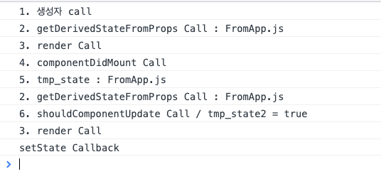
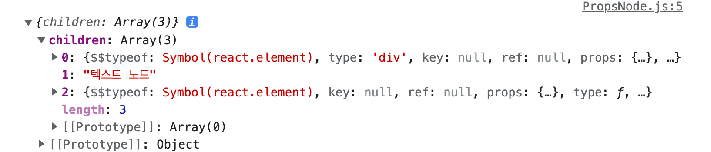
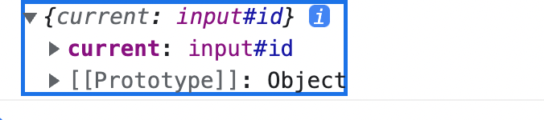

# 초보자를 위한 React 200제 학습 내용 정리
> 나도 이제 리액트를 시작해본다.

<br><br>

## 1 ~ 16 리액트 라이프사이클 함수
```js
// SimpleComponent.js
class SimpleComponent extends Component {
  static getDerivedStateFromProps(props, state) {
    console.log('2. getDerivedStateFromProps Call : ' + props.prop_value);
    
    return { tmp_state: props.prop_value };
  }
  constructor(props) {
    super(props);
    this.state = {};
    console.log('1. 생성자 call')
  }

  componentDidMount() {
    console.log('4. componentDidMount Call');
    console.log(`5. tmp_state : ${this.state.tmp_state}`);

    this.setState({tmp_state2: true}, () => console.log('setState Callback'));
  }

  shouldComponentUpdate(props, state) {
    console.log(`6. shouldComponentUpdate Call / tmp_state2 = ${state.tmp_state2}`)
    return state.tmp_state2;
  }

  render() {
    console.log('3. render Call')
    return (
      <h2>[THIS IS IMPORTED COMPONENT]</h2>
    )
  }
}
```

```js
// App.js
import './App.css';
import SimpleComponent from './R006_ImportComponent'

function App() {
  return (
    <div>
      <h1>Start React 200!</h1>
      <p>HTML 적용하기</p>
      <SimpleComponent 
        prop_value = 'FromApp.js'
      />
      
    </div>
  );
}

export default App;
```
출력 결과 <br>




1. `constructor`
2. static `getDerivedStateFromProps`
- 컴포넌트가 새로운 props를 받게 됐을 때 state를 변경해준다. 반환하는 객체를 state에 머지해줌
3. `render`
- 랜더링할 HTML 내용을 반환한다.

4. `componentDidMount` 
- 컴포넌트가 랜더링 된 이후(DOM 트리에 마운트) 실행된다.

5. [`shouldComponentUpdate`](https://ko.reactjs.org/docs/react-component.html#shouldcomponentupdate)
- 컴포넌트의 `props`나 `state`가 변경될 때 실행된다. 위 코드에서 `componentDidMount`에서 `this.setState` 호출 결과로 실행됨.
- 반환 타입은 `boolean`으로, `true`반환시 `render`를 호출한다.

<br><br>

## 17 ~ 65 리액트 기초 다지기

### 17-19. `props` 사용하기
- `props`는 부모 컴포넌트에서 자식 컴포넌트에 데이터를 전달하는 용도로 사용된다. Angular의 `@Input()`과 같은 역할을 한다고 볼 수 있다.
- 자식 컴포넌트에서 수정 불가능하다.

```js
// App.js
import PropsDataType from './R018_PropsDataType';

function App() {
  return (
    <div>
      <h1>Start React 200!</h1>
      <p>HTML 적용하기</p>
      <PropsDataType 
        String = 'react'
        Number = {200}
        Boolean = {true}
        Array = {[0,1,2]}
        ObjectJSON = {{react: "리액트"}}
        Function = {console.log("Function")}
        Callable = {() => console.log("Callable")}
      />
      
    </div>
  );
}

export default App;
```
```js
// R018_PropsDataType.js
import React, { Component } from "react";
import datatype from 'prop-types';

export default class PropsDataType extends Component {

  render() {
    let {
      String, Number, Boolean, Array, ObjectJSON, Function, Callable
    } = this.props;
    return (
      <div style={{padding: "0px"}}>
        <p>String Props: {String}</p>
        <p>Number Props: {Number}</p>
        <p>Boolean Props: {Boolean}</p>
        <p>Array Props: {Array.toString()}</p>
        <p>ObjectJSON Props: {JSON.stringify(Object)}</p>
        <p>Function Props: {Function}</p>
        <p>Callable Props: {Callable()}</p>
      </div>
    )
  }
}
PropsDataType.propTypes = {
  String: datatype.string,
  Number: datatype.number,
  Boolean: datatype.bool,
  Array: datatype.array,
  ObjectJSON: datatype.object,
  Function: datatype.string,
  Callable: datatype.func,
}
```
- `string`타입은 그냥 넘겨줄 수 있고, 나머지 타입은 `{}`로 감싸서 넘겨줘야 한다.
- 화면에 출력시 string으로 변환해서 출력해줘야 한다. 객체의 경우 그냥 바인딩 시키면 에러가 나면서 앱이 중지된다.
- props에 대한 타입 정의는 `Component.propTypes`에 객체를 할당해 할 수 있다. [`prop-types` 모듈](https://ko.reactjs.org/docs/typechecking-with-proptypes.html#gatsby-focus-wrapper)의 `datatype`객체를 사용한다.
- 이 때, 타입 정의에 맞지 않는 값이 넘어와도, 콘솔에 오류만 출력하고 동작을 막진 않는다.

<br>

### 19. Booelan 타입 props
- `Boolean`타입으로 정의한 경우 경우 값을 넘기지 않으면 기본값 `true`다.(부모에서 선언은 해줘야함)

<br>

### 20. 객체 타입 props 
- 객체 자료형은 `datatype.shape()` 함수를 이용해 아래와 같이 상세하게 선언할 수 있다.
```js
Component.propTypes = {
  ObjectJson: datatype.shape({
    string: datatype.string,
    number: datatype.number
  })
}
```

<br>

### 21. datatype.isRequired
- `datatype.isRequired`를 이용해 props가 부모 컴포넌트로부터 필수로 넘어와야 함을 정의할 수 있다. 값이 안넘어와도 에러메시지만 출력한다.
```js
export default class PropsRequired extends Component {
  // ...
}

PropsRequired.propTypes = {
  ReactString: datatype.isRequired,
}
```

<br>

### 22. props의 기본값
- `Component.defaultProps`에 `props`의 기본값 객체를 할당할 수 있다. props가 넘어오지 않아도 기본값이 할당된다.
- `datatype.isRequired`가 설정된 `props`에 기본값을 설정해도, 값이 안넘어오면 에러메시지가 출력된다.
```js
export default class PropsRequired extends Component {
  // ...
}
// 컴포넌트 props에 기본값 할당
PropsRequired.defaultProps = {
  ReactString: "리액트",
  ReactNumber: 200
}
```


<br>

### 23. 자식 컴포넌트에 node 객체 전달
- 자식 컴포넌트에 노드 객체를 전달할 수 있다. `HTMLElement`나 `React Component` 등이 가능하다.
- 자식 컴포넌트에서 `props.children`으로 참조한다.
- `WebComponent`의 `slot`이나 `Angular`의 `ContentProjection`과 같은 개념이다.
```js
// PropsNode.js
import {Component} from 'react'

export default class PropsNode extends Component {
  render() {
    console.log(this.props);
    return (
    <div style={{padding: "0px"}}>
      {this.props.children}
    </div>
    )
  }
}
```
```js
function App() {
  return (
      <PropsNode>
        <div>div 노드</div>
        텍스트 노드
        <PropsRequired />
      </PropsNode>
  );
}
export default App;
```

콘솔 출력 <br>



<br>

### 24. [`state` 사용하기](https://ko.reactjs.org/docs/faq-state.html#gatsby-focus-wrapper)
- `props`와 달리 `state`는 부모 컴포넌트로부터 전달되는것이 아닌, 컴포넌트 내부에서 생성/관리된다. 상세 내용은 [props vs state](https://ko.reactjs.org/docs/faq-state.html#gatsby-focus-wrapper)가 있다.
- `state`에 값을 할당하는 방법은 `할당`과, `setState()`가 있는데 일반적인 할당 사용시 `shouldUpdateComponent()`가 실행되지 않고 랜더링도 실행되지 않는다.

<br>

### 25. setState() 함수 사용하기
- state의 단순 할당은 `render()`함수를 호출하지 않으므로 상태 변경을 랜더링하지 못한다.
- `setState()` 함수로 state 변경시 `render()`함수가 재호출되어 상태가 변경된다.

<br>

### 26. [forceUpdate()](https://ko.reactjs.org/docs/react-component.html#forceupdate) 함수 사용하기
- state 직접 변경시, 랜더링이 자동으로 안되는데, `forceUpdate()`를 호출하면 강제로 랜더링을 호출해준다.
- `forceUpdate()`의 실행으로 , `shouldUpdateComponent()`는 호출되지 않는다. 
- ***리액트 공식 가이드에서 가급적 사용하지 말것을 권하는 메서드다.***


<br>

### 27 - 28. [Component](https://ko.reactjs.org/docs/react-component.html#gatsby-focus-wrapper), [PureComponent](https://ko.reactjs.org/docs/react-api.html#reactpurecomponent) 
- `Component`와 `PureComponent` 모두 컴포넌트의 `props`와 `state`의 변화를 감지하여 랜더링을 수행한다.
- `Component`는 비교 대상이 완전히 동일하지 않으면 `render()`를 수행한다.(깊은비교)
- 반면 `PureComponent`아래와 같이 얕은 비교를 수행한다.(성능이 좋다.)
  - `원시타입`은 값의 `동등성`만 비교한다.
  - `객체타입`의 값은 `참조값`을 비교한다.

```js
export default class PureComponentClass extends PureComponent {
  constructor(props) {
    super(props);
    this.state = {
      StateString: 'react',
      StateArrayObj: ['react', { react: '200' }]
    }
  }

  buttonClick = (type) => {
    if(type === 'String') {
      this.setState({ StateString: 'react' });
    }
    if(type === 'ArrayObject') {
      this.setState({ StateArrayObj: ['react', { react: '200' }]})
    }
  }

  render() {
    console.log('render');

    return(
      <div>
        <button onClick={e => this.buttonClick('String')}> 문자열 변경 </button>
        <button onClick={e => this.buttonClick('ArrayObject')}>객체 배열 변경</button>
      </div>
    )
  }
}
```
- 위 `PureComponent`에서, 문자열 변경 버튼 클릭시 원시값의 참조만 바뀌는데, 원시값은 동등성 비교를 수행하므로 랜더링 수행하지 않는다.
- 객체 배열 변경 클릭시, 객체가 새로 덮어써져 참조가 바뀌므로 랜더링을 수행한다.

<br>

### 29. [shallow-equal](https://www.npmjs.com/package/shallow-equal) 사용하기
- `shallow-eqaul` 패키지는 `PureComponent`의 `shouldUpdateComponent()` 내에서 `state`, `props`의 얕은 비교와 동일한 기능을 하는 함수를 제공한다. 
- `shallowEqaulArrays()` 메서드는 문자열과 배열은 값만 비교한다.(동등성)
```
npm i --save-dev shallow-equal
```
- 설치후 일반 `Component`의 `shouldUpdateComponent()`를 아래와 같이 구현해 `PureComponent`와 같은 성능을 내게 만들 수 있다.
```js
import { Component } from "react";
import { shallowEqualArrays } from 'shallow-equal'
export default class ShallowEqual extends Component {
  // ...
  shouldComponentUpdate(nextProps, nextState) {
    return !shallowEqualArrays(this.state, nextState);
  }
  // ...
}
```

<br>

### 30. [함수형 컴포넌트](https://ko.reactjs.org/docs/components-and-props.html#function-and-class-components)
- 함수형 컴포넌트는 클래스형 컴포넌트와 달리 ***`state`가 없고, `생명주기 함수`를 사용할 수 없다.***
- 상위 컴포넌트에서 `props`와 `context`를 함수 파라미터로 전달받고, `return`값을 랜더링한다.

```js
// FunctionComponent.js
export default function FunctionComponent (props) {
  let { contents } = props;
  return (
    <h2>{contents}</h2>
  )
}
```

```js
// App.js
import FunctionComponent from './FunctionComponent'
function App() {
  return (
    <FunctionComponent contents={"함수형 컴포넌트 입니다."} />
  );
}
export default App;
```

<br>

<br>

### 31. hook 사용하기
`hook`은 함수형 컴포넌트에서 사용된다. `useState`와 `useEffect` 훅에 대해 알아본다.
1. [useState](https://ko.reactjs.org/docs/hooks-reference.html#usestate)
```js
const [count, setCount] = useState(initialCount);
```

- useState(초기상태)의 결과로 길이 2의 배열을 반환하는데, 첫번째부터 각각 상태/setter함수 이다.
- 위 훅에서 `setCount`는 클래스 컴포넌트의 `setState`와 거의 같은 동작을 하는데, 차이점은 `setState`와 ***달리 상태 merge 기능이 없다는 것***이다. 상태를 merge하려면 `setter`함수를 아래와 같이 사용하면 된다.
```js
const [state, setState] = useState({});
setState(prevState => {
  // Object.assign would also work
  return {...prevState, ...updatedValues};
});
```

<br>

2. [useEffect](https://ko.reactjs.org/docs/hooks-reference.html#useeffect)
- 랜더링 후에 실행되는 훅이다.
- 명령형 또는 어떤 effect를 발생하는 함수를 인자로 받는다. 무슨말인지 실제 사례를 보면서 이해한다
- 아래는 랜더링마다 그냥 의미없는 출력을 하는 코드다.
```js
// 최초 랜더링시에 useEffect 출력하고, 그 이후 리랜더링마다 역시 출력한다.
useEffect(() => {
  console.log('useEffect');
})
```
- 랜더링하면서 기존 랜더링에서 사용하던 리소스를 정리하게 할 수 있다. ***훅 인자로 전달된 함수의 결과로 리소스 정리 함수를 반환하면*** 다음 ***useEffect 훅 실행 전에 이게 실행된다.***
```js
useEffect(() => {
  // 최초 랜더링시 구독, 매 랜더링마다 다시 구독
  const subscription = props.source.subscribe();
  return () => {
    // 최초 랜더링 이후 매 랜더링마다 구독 해제하고, 위의 구독을 다시 수행함
    subscription.unsubscribe();
  };
});
```

<br>

### 32. [Fragments](https://ko.reactjs.org/docs/fragments.html#gatsby-focus-wrapper) 사용하기
- 컴포넌트의 element 반환 시, 하나의 태그로 감싸진 내용을 반환하지 않으면 에러가 발생한다.
- 이 때 html의 `template` 태그처럼 전체를 감싸서 DOM에 추가했을 때 내용물만 추가되고 본 태그는 없어지게 할 수 있는데 리액트의 `Fragment`다.(웹의 DocumentFragment와 같다고 보면 될듯)
```js
export default function Fragments () {
  return (
    <React.Fragment>
      <div>내용1</div>
      <p>내용2</p>
    </React.Fragment>
  )
}
```
- `key`가 없다면 `<>`를 사용해도 된다.
```js
export default function Fragments () {
  return (
    <>
      <div>내용1</div>
      <p>내용2</p>
    </>
  )
}
```

> 궁금해서 `<React.Frament>` 말고 `<templat>`으로 감싸서 컴포넌트를 반환했지만 `template`태그가 사라지지 않아 실제 랜더링 되진 않았다.

<br>

### 33. map()으로 element 반환하기
- `Angular`의 `ngFor`같은게 리액트에는 따로 없는모양이다. 그냥 `Array.prototype.map`을 이용해서 배열을 순회하는 방식으로 element를 만들어내자.
- 이 때, `Vanllia js`에서 하듯 출력을 string 타입으로 취급하는게 아니라서, `.join('')`과 같은 마무리는 필요하지 않다.

```js
export default function ReturnMap() {
  const elementArray = [
    <li>react</li>,
    <li>angular</li>,
    <li>vue</li>
  ]
  return (
    <ul>
      { elementArray.map(el => el) }
    </ul>
  )
}
```
- 또 신기한건 `li`요소를 템플릿 리터럴같은걸 이용해 string으로 정의한게 아니라, HTML 그대로 배열로 만들었다는 것이다.
- ***`elemntArray`를 `string[]`으로 정의하면 그냥 text node로 처리되어 랜더링된다.***

<br>

### 34~ [Reactstrap](https://www.npmjs.com/package/reactstrap)
- `Reactstrap`은 리액트용 부트스트랩 패키지다. 사용을 위한 설정은 아래와 같다. 내부적으로 `bootstrap`의 컴포넌트 요소들을 `리액트 컴포넌트`로 정의해놨고, 이를 가져다 쓰기만 하면 된다.

```bash
$npm i --save bootstrap reactstrap
```
```js
// App.js
import 'bootstrap/dist/css/bootstrap.css'
```
- 컴포넌트의 props등은 메뉴얼을 참조해서 쓰자.


<br>

> ~65까지는 bootstrap, swwetalert, axios 등의 라이브러리와 자바스크립트 관련 내용으로 생략한다.

<br>

### 66 ~ 72 는 이벤트 핸들러 관련 내용으로, 자바스크립트의 on{EVENT} 와 같으므로 생략한다.

<br>

### 73. [Ref](https://ko.reactjs.org/docs/react-api.html#refs) 사용하기
- ref는 element에 대한 참조를 제어하는것으로, document의 `querySelecotr`같은 역할을 한다고 보면 된다.
```js
export default class ReactRef extends Component {
  constructor(props) {
    super(props);
    this.InputRef = React.createRef();
  }

  RefFocus = () => {
    this.InputRef.current.focus();
  }

  JavascriptFocus() {
    document.getElementById('id').focus();
  }

  componentDidMount() {
    // 랜더링 후 ref 출력
    console.log(this.InputRef)
  }

  render() {
    return(
      <>
        <input id="id" type="text" ref={this.InputRef} />
        <input type="button" value="Ref Focus" onClick={this.RefFocus} />
        <input type="button" value="Javascript Focus" onClick={this.JavascriptFocus} />
      </>
    )
  }
}
```

==== 출력 결과 ==== <br>


- ref는 `React.createRef()` 함수로 만들 수 있고, element의 `ref` 어트리뷰트에 ref 객체를 를 할당함으로써 참조할 수 있다. 이 때 ref 객체의 `current` 속성에 Element가 할당된다. 위 결과처럼 selector값이 저장된다!

<br>

### 74. 커링 함수 구현하기
- `커링`(Currying)은 ***함수의 재사용을 높이기 위해 함수 자체를 return 하는 함수다.*** 고차함수랑 같은건가?
```js
// 일반 함수
const plusNumOrString = (a, b) => a + b;

// 커링함수
const plusFunction1 = (a) => {
  return function(b) {
    return plusNumOrString(a, b);
  }
}
const plusFunction2 = (a) => (b) => plusNumOrString(a, b);
```


