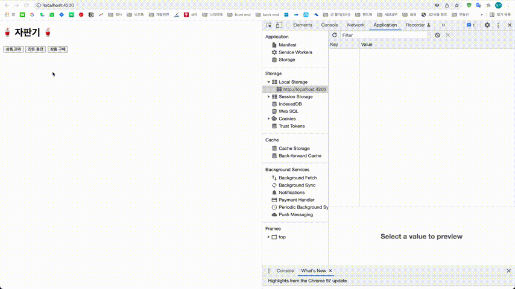

# 우테코 FE 미션 풀어보기
> 바닐라 자바스크립트를 이용한 자판기 앱 만들기

- 미션 상세보기 : https://github.com/woowacourse/javascript-vendingmachine-precourse
-  미션 기본 규칙 외에 아래 내용 추가함
  - `jest`를 이용한 비즈니스 로직 유닛 테스틑
  - `webpack` 을 이용한 build, serve
  - `prettier`를 이용한 코드 포맷팅

<br>

### 목차
### [1. 실행하기](#1-실행하기-1)
### [2. 동작 영상](#2-동작-영상-1)
### [3. 프로젝트 구조](#3-프로젝트-구조-1)
### [4. 프로젝트 설명](#4-프로젝트-설명-1)

<br><br>

## 1. 실행하기
```
npm i
npm run test
npm run start
```

<br>

## 2. 동작 영상


<br>

## 3. 프로젝트 구조
```bash
├── src
│   ├── constant # 상수
│   │   ├── constant.js # 프로젝트에 사용되는 상수
│   │
│   ├── core # 전역적으로 사용되는 객체
│   │   ├── vm-error.js # 사용자 정의 에러
│   │
│   ├── css # css파일
│   │   ├── style.css # 전역 css파일
│   │
│   ├── model # 애플리케이션 상태 관리 관련 기능 모음
│   │   ├── model-instance.js # 애플리케이션에서 사용되는 상태 객체 인스턴스
│   │   ├── model.js # 애플리케이션 상태 객체(factory 함수)
│   │   ├── model-spec.js # model.js 유닛 테스트
│   │   ├── observable.js # 상태 객체를 구독 가능한 옵저버블로 만드는 observable factory 함수
│   │   └── observable.spec.js # observable.js 유닛 테스트
│   │
│   ├── router # 프로젝트 라우터 
│   │   ├── router.js # history api 기반 라우터 생성 함수
│   │   ├── router-spec.js # router.js 유닛 테스트
│   │   │
│   │
│   ├── utils
│   │   ├── common-util.js # 일반 유틸 함수
│   │   ├── common-util.spec.js # common-util.js의 유닛 테스트
│   │   ├── model-util.js # model에서 사용되는 유틸 함수
│   │   ├── model-util.spec.js # model-util.js의 유닛 테스트
│   │   ├── validation-util.js # 사용자 입력 검증 관련 유틸
│   │   └── validation-util.spec.js # validation-util.js의 유닛 테스트
│   │
│   ├── view # 클래스 상속을 위한 부모 클래스 모음
│   │   ├── product-add # 상품 관리
│   │   │   ├── ProductAdd.js # 상품 추가하기 컴포넌트
│   │   │   ├── ProductAddForm.js # 상품 추가하기 폼 컴포넌트
│   │   │   ├── ProductAddForm.spce.js # ProductAddForm.js의 유닛 테스트
│   │   │   └── ProductTable.js # 상품 목록 컴포넌트
│   │   │
│   │   ├── product-purchase # 상품 구매
│   │   │   ├── CustomerCharge.js # 투입 금액 컴포넌트
│   │   │   ├── CustomerChargeForm.js # 금액 투입하기 컴포넌트
│   │   │   ├── CustomerChargeTable.js # 잔돈 컴포넌트
│   │   │   ├── ProductPurchase.js # 상품 구매하기 컴포넌트
│   │   │   └── ProductPurchaseTable.js # 구매 가능한 상품 목록 컴포넌트
│   │   │
│   │   ├── vending-machine-manage # 잔돈 충전
│   │   │   ├── ChargeForm.js # 잔돈 충전하기 폼 컴포넌트
│   │   │   ├── ChargeTable.js # 잔돈 테이블 컴포넌트
│   │   │   ├── CurrentChange.js # 보유 금액 컴포넌트
│   │   │   └── VendingMachineManage.js # 잔돈 충전 컴포넌트
│   │   │   
│   │   └── app.js # 앱의 루트 컴포넌트
│   │
│   └── index.js # 앱의 entry point
│   │
└── .eslintrc # lint 설정
│   
└── .prettierrc # prettier 설정
│   
└── babel.config.json # 바벨 설정
│   
└── index.html 
│   
└── .jest.config.js # jest 설정
│   
└── .webpack.config.js # 웹팩 설정
```

<br>

## 4. 프로젝트 설명
1. 기능
    - 애플리케이션 기능은 미션에 제시된 [기능 요구사항](https://github.com/woowacourse/javascript-vendingmachine-precourse#-%EA%B8%B0%EB%8A%A5-%EC%9A%94%EA%B5%AC-%EC%82%AC%ED%95%AD)을 그대로 구현하였다.

<br>

2. 빌드
    - `webpack`을 이용해 빌드한다. 
    - `babel-loader`를 이용해 트랜스파일 하고, `style-loader`, `css-loader`를 이용해 `css`를 `import`한다.
    - `HtmlWebpackPlugin`을 이용해 `index.html`에 엔트리 포인트인 `index.js`를 `import`한다
    - `webpack-dev-server`를 이용해 앱을 실행할 수 있다.

<br>

3. 컴포넌트
        -  화면 구성에 사용된 컴포넌트는 [`WebComponent`](https://www.webcomponents.org/)를 사용해서 구현한다.

<br>

4. 상태 관리
    - 애플리케이션 전역에서 사용 가능한 상태 모듈(`model.js`)을 이용한다.
    - 컴포넌트가 상태 변화에 따라 자동으로 다시 랜더링 될 수 있도록, 상태를 ***구독 가능한 반응형 모델***로 만든다.(`observable.js`) 
    - 이를 위해 자바스크립트의 [`native proxy`](https://developer.mozilla.org/en-US/docs/Web/JavaScript/Reference/Global_Objects/Proxy)객체를 이용해 상태 객체의 `setter`함수를 오버라이드 하여, `setter` 호출시 상태를 구독중인 모든 컴포넌트의 랜더링 함수(`listeners`)가 실행된다.
    - 구독 함수(`addChangeListener`)의 결과로 반환되는 구독 해제 함수(`unsubscribe`)를 웹 컴포넌트의 `disconnectedCallback` 함수에 실행해, 메모리 누수를 막는다.
    - 프로젝트 요구사항인 local storage에서의 상태 저장 기능을 위해, model 인스턴스 생성시 아래 과정을 수행한다.(`model-instance.js`)
        - local storage에서 상태값 조회하여 모델 인스턴스 생성시 전달
        - 상태 변화시 local storage에 변화된 상태를 저장하는 함수가 모델 인스턴스를 **구독**
    
<br>

5. 라우터
    - 라우터는 브라우저의 `history API`를 기반으로 라우터를 구현한다.(`router.js`)
    - 라우터 인스턴스 생성시 `routes`객체를 전달해, url과 컴포넌트의 맵핑 레지스트리를 생성한다.
    - 앱 컴포넌트에 `router`객체를 주입하고, 라우터 네비게이션 버튼(`button[data-navigation]`) 클릭 시 라우터의 `navigate` 함수가 호출되고, url과 매칭되는 컴포넌트를 랜더링한다.

<br>

6. 에러 처리
- `window` 객체에 `onerror` 핸들러를 등록하고, 애플리케이션에서 정의한 `VMError` 발생시 프로젝트 요구사항대로 `alert`으로 해당 메시지를 사용자에게 보여준다.(`index.js`)
